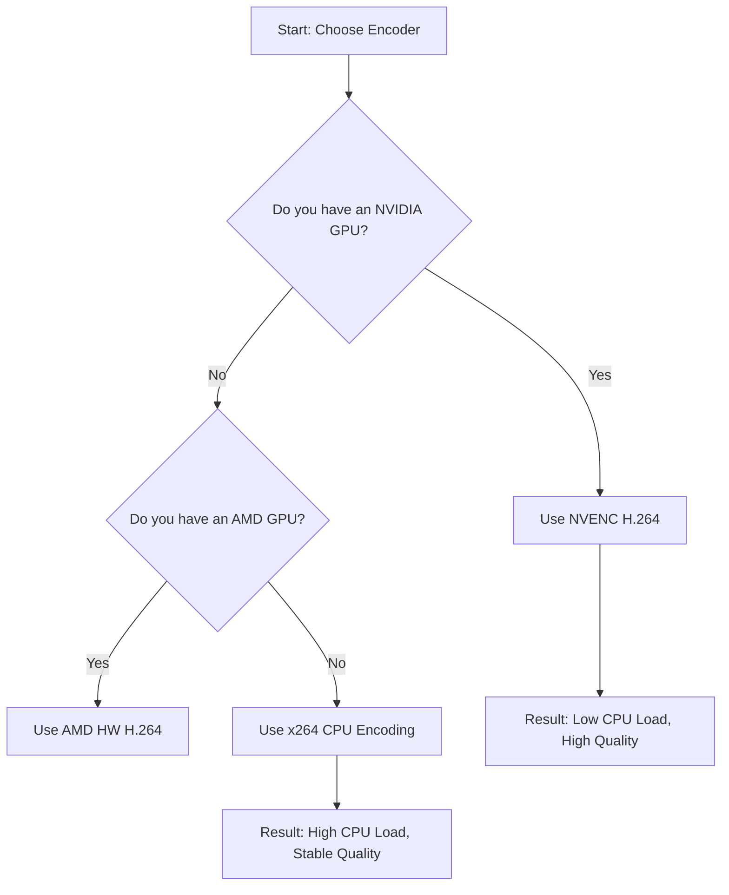

## The "Blurry Gameplay" Problem on TikTok

You’ve set up OBS, you’re playing a high-intensity game, but your TikTok Live looks like a pixelated mess. Or worse, your stream is laggy even though your PC is a beast. 

The problem is that most creators apply their Twitch or YouTube settings to TikTok. But TikTok’s architecture—specifically its **vertical-first requirement** and **bitrate caps**—requires a completely different approach to OBS configuration.

---

## Why Standard Settings Fail on TikTok

TikTok Live is designed for mobile consumption. When you try to push a standard 1080p horizontal signal into a vertical space, you lose over 60% of your screen real estate to black bars, or you force TikTok to rescale your image, which introduces heavy artifacts.

Furthermore, TikTok’s ingest servers are notoriously sensitive to bitrate fluctuations. If your bitrate isn't "Stable" (CBR), the app will aggressively drop your quality to prevent buffering, leading to that "blocky" look during fast motion.

---

## Core Insight: The Vertical Tax

The key to a crisp TikTok gaming stream isn't just "higher numbers." It's about **matching your canvas to the platform's native resolution**. 

### One Paragraph Insight
Every time OBS has to "downscale" or "rescale" a frame before sending it to TikTok, you pay a "performance tax" in both CPU usage and visual clarity. By setting your **Canvas Resolution** to a native vertical format (1080x1920) and matching your **Output Resolution** exactly, you bypass the rescaling engine entirely, preserving every pixel of your gameplay.

---

## The Ultimate Settings Checklist

Here are the recommended settings for a stable, high-quality gaming stream.

### 1. Video Tab (The Canvas)
*   **Base (Canvas) Resolution**: 1080x1920 (Type this in manually).
*   **Output (Scaled) Resolution**: 1080x1920.
*   **Downscale Filter**: Not Applicable (since resolutions match).
*   **Common FPS Values**: 60 (for shooters/action) or 30 (for card games/RPGs).

### 2. Output Tab (The Encoder)
Go to **Output Mode: Advanced** and select the **Streaming** tab.

*   **Encoder**: NVIDIA NVENC H.264 (If you have an NVIDIA GPU) or x264 (If you have a high-end CPU).
*   **Rate Control**: CBR (Mandatory for stability).
*   **Bitrate**: 6000 Kbps (If your upload speed is 10Mbps+). Use 4000 Kbps for slower connections.
*   **Keyframe Interval**: 2 s.
*   **Preset**: P5: Slow (Good Quality) or P6: Slower (Better Quality).
*   **Tuning**: High Quality.
*   **Multipass Mode**: Two Passes (Quarter Resolution).
*   **Profile**: high.

---

## Choosing Your Encoder

Use this flow to decide which hardware should do the heavy lifting:

### What this diagram shows
This decision tree helps you minimize "Encoding Overload" errors. Gaming already stresses your CPU/GPU; picking the right encoder ensures your stream doesn't crash while you're in a match.

---

## Verification & Edge Cases

### The "Stats" Check
Before going live, go to **View > Stats** in OBS. 
*   **Dropped Frames (Network)**: If this is above 1%, your bitrate is too high for your internet.
*   **Frames Missed due to Rendering Lag**: If this is high, your GPU is overloaded. Lower your in-game graphics settings.
*   **Skipped Frames due to Encoding Lag**: Your encoder preset is too "Slow." Change it to P4 or P3.

### The "Virtual Camera" Trap
If you are using the **TikTok Live Studio** and pulling OBS in via "Virtual Camera," your quality will be capped at whatever the Virtual Camera output is (often 720p). For the best results, use a **Stream Key** (if you have one) or ensure your Virtual Camera settings in OBS match your 1080x1920 canvas.

### Low Upload Speed?
If your upload is below 5Mbps, don't try to stream at 1080p. Drop your Canvas and Output to **720x1280** and set your bitrate to **2500 Kbps**. A crisp 720p stream looks much better than a blurry, stuttering 1080p stream.
