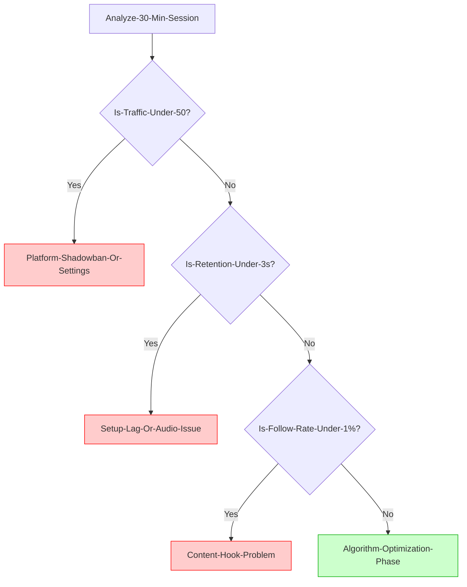

## TL;DR
If you’re consistent on TikTok Live but not growing, it’s almost never “TikTok hates me” and almost never “my setup is cursed.” It’s usually one bottleneck: **distribution** (new viewers aren’t entering), **retention** (they enter and leave fast), or **conversion** (they watch but don’t follow). This guide helps you identify which one you have in one week.

## Introduction
The most confusing TikTok Live situation is the “I’m doing the work” phase:

- You go live 4–6 days a week.
- Your stream looks fine to you.
- You’re not getting banned.
- But your numbers feel glued in place.

On r/TikTokCreators, this turns into the same argument every time:

- “It’s the platform. TikTok stopped pushing Lives.”
- “No, your stream packaging is weak. People don’t click.”
- “You’re dropping quality or audio and don’t realize viewers are leaving.”

All three can be true. The problem is most creators try to fix all three at once (random tweaks) and learn nothing.

This post is a decision guide so you can answer one question with confidence: **is your growth problem the platform, your setup, or your stream packaging?**

## Decision Guide: Platform vs Setup (Use This Order)

### Step 1: Define what “no growth” actually means
Pick one metric for the next 7 days. Otherwise you’ll “feel stuck” even if one part is improving.

Use one of these:
- **New viewers per hour**: are fresh people entering your Live?
- **Average viewers**: is your baseline slowly rising?
- **Follows per hour**: do viewers take an action?

If you want a simple scoreboard, track this after every stream:
- time live
- peak viewers
- average viewers
- follows gained
- any quality warnings (dropped frames, audio clipping, disconnects)

### Step 2: Identify your bottleneck (distribution, retention, conversion)
Most “platform vs setup” debates are really bottleneck debates.

#### Bottleneck A: Distribution (people aren’t entering)
Signs:
- You sit at 0–3 viewers for long stretches
- The first 10 minutes feels dead
- Your stream only gets traffic when a friend joins

#### Bottleneck B: Retention (people enter, then bounce)
Signs:
- You get “random joins,” but viewers disappear in seconds
- You see short spikes, then immediate drops
- You get likes but almost no watch time (people tap and leave)

#### Bottleneck C: Conversion (they watch, but don’t follow)
Signs:
- You can hold a room, but follows stay flat
- You end a 2-hour stream with “nice chat” and near-zero account growth

### Step 3: Run the 3 checks (fast, not emotional)

#### Check 1: Setup/quality stability (eliminate silent technical self-sabotage)
If your stream is unstable, you’ll look “not pushed” even when TikTok tests you. Viewers enter, feel friction, leave, and TikTok stops testing.

Do one stream where you deliberately run a stability baseline:
- `720x1280 @ 30 FPS`
- `CBR 2500–3500 Kbps`
- keyframe interval `2`
- wired Ethernet if possible
- phone watch test on LTE (not the same Wi‑Fi)

If you see dropped frames, audio distortion, or disconnect warnings during this baseline, you don’t have a “platform problem” yet. You have a **reliability problem**.

#### Check 2: Packaging (would you click your Live?)
Creators underrate this because it feels “marketing-y.” But TikTok Live is a scroll environment. People don’t owe you attention.

For one week, your goal is not “be entertaining.” Your goal is **make the room understandable in 1 second**.

Run this packaging reset:
- Put an on-screen line of text: “TODAY: (challenge / goal / question)”
- Change your title from a vibe to an outcome:
  - Bad: “Chilling / grinding / vibes”
  - Better: “Can we hit rank in 2 hours? (no backseating)”
  - Better: “Chat chooses my loadout every death”
- Every 3 minutes, say a one-sentence loop: “If you just joined, here’s what we’re doing…”

If your traffic increases but people still leave, packaging worked and retention didn’t. If traffic doesn’t increase, you may have distribution issues (or your packaging still isn’t clear).

#### Check 3: Distribution (is TikTok testing you at all?)
If you’re getting your baseline stable and you’ve tightened packaging, then test distribution.

Use a simple “entry test” for 3 streams in a row:
- Same format, same title style, same scene
- Track: how many unique people entered in the first 10 minutes (even if they left)

If your first 10 minutes consistently stays near-zero, your issue is likely:
- your account is not being tested much (distribution)
- your niche/topic isn’t matching any Live audience cluster right now
- you have account-level friction (restrictions, violations, age gating, region, device risk signals)

### The Diagnostic Flowchart

If you're stuck, use this logic to find your bottleneck:

### 1. The "Platform" Reality Check
Many creators scream "shadowban" when their setup is actually the culprit.

---

## If It’s Setup: The “Stop Bleeding” Fix List
When creators say “platform vs setup,” they usually mean “do I need better gear?”

Most of the time, no. You need less chaos:
- lock in `720p30` until growth returns
- simplify scenes (fewer browser sources)
- fix audio first (clear voice beats sharp video)
- keep bitrate stable (don’t spike)
- avoid Wi‑Fi if your stream ever stutters

If you stream from a PC, treat “stability” like a feature. TikTok punishes spiky streams more than you think.

## If It’s Platform/Distribution: What to Do Without Panic
If your baseline is stable and your packaging is clear but you aren’t getting tested, don’t jump to “new account.”

Try these in this order:

### 1) Check for hidden friction
- Account health / violations (even “resolved” ones can reduce testing temporarily)
- Age-restricted words or visuals
- VPNs, proxies, or weird network routes
- Going live right after posting something that got flagged

### 2) Change topic framing, not your identity
Same game, different angle:
- from “ranked grind” to “chat coaching challenge”
- from “just playing” to “speedrun attempts”
- from “vibes” to “one specific question”

TikTok clusters Lives by what it can recognize quickly. Give it a recognizable container.

### 3) Run a 7-day experiment instead of random tweaks
Pick ONE change per week:
- Week A: packaging only
- Week B: retention only (pacing + loop)
- Week C: conversion only (follow reason + schedule)

If you change everything every night, you’ll never know what worked.

## Actionable Checklist (7 Days)
- [ ] Track peak/avg viewers and follows per stream
- [ ] Run one stability-baseline stream (`720p30`, `CBR 2500–3500`, keyframes `2`)
- [ ] Watch your own Live from a phone on LTE once
- [ ] Add one on-screen line explaining the stream goal
- [ ] Replace vibe titles with outcome titles for 7 days
- [ ] Say the “if you just joined” loop every 3 minutes
- [ ] Fix one bottleneck per week (distribution, retention, or conversion)

## FAQ

### “Is TikTok Live just not pushing anyone right now?”
TikTok traffic comes in waves, but most “no growth” cases are still bottleneck problems. The fastest way to know is the entry test: if people never enter, it’s distribution. If they enter and leave, it’s retention or setup friction.

### “Do I need a better setup to grow?”
Only if your current setup creates friction (bad audio, stutters, disconnects). Better gear doesn’t fix unclear packaging or weak retention.

### “Should I start a new account?”
Usually no. A new account can give a short “newness test,” but you’ll hit the same wall unless you fix the bottleneck. Consider a new account only if your main account has repeated policy issues or you previously bought followers.

### “How long should I give a change before deciding it worked?”
Run changes in 7-day blocks. TikTok Live is noisy day-to-day. You need a week to see a trend.

### “What’s the most important metric for Live growth?”
If you can only track one: **follows per hour**. Viewers come and go. Follows tell you the stream created enough value for someone to commit.

## Practical Conclusion
“Consistent but no growth” feels personal because you’re showing up. But TikTok Live doesn’t reward effort. It rewards signals.

Stop asking “platform vs setup?” and start asking: **distribution, retention, or conversion?** Fix one bottleneck for one week. You’ll get clarity fast—and clarity is what gets you unstuck.
