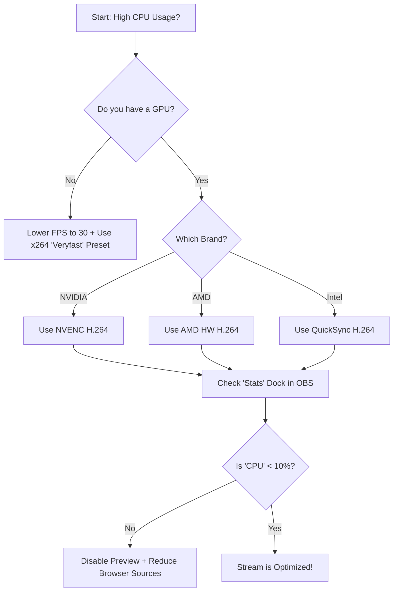

## The "Encoder Overloaded" Nightmare

You’ve finally got your TikTok Live access, you’ve set up your vertical scenes in OBS, and you hit "Start Streaming." Suddenly, your gameplay starts stuttering, your voice desyncs, and a red warning flashes at the bottom of OBS: **"Encoding overloaded! Consider turning down video settings or using a faster encoding preset."**

For TikTok creators, this is especially frustrating because you're often running OBS *and* TikTok Live Studio simultaneously, creating a massive resource bottleneck that can kill your stream quality before it even begins.

---

## Root Cause: Why TikTok Live Crushes Your CPU

Most streamers run into high CPU usage because of three main hidden factors:

1.  **Software Encoding (x264):** By default, some systems try to use the CPU (x264) to "render" the video. While high quality, it is incredibly taxing during fast-paced gaming.
2.  **Resolution Scaling Overhead:** If your OBS Canvas is 1920x1080 (Horizontal) but you are outputting to TikTok at 1080x1920 (Vertical), OBS has to work extra hard to rescale every single frame.
3.  **Source Overload:** Using too many "Browser Sources" (like complex alerts) or high-resolution webcams without hardware acceleration.

---

## Core Insight: Offloading the Work

The secret to low CPU usage isn't "buying a better computer"—it's **Hardware Delegation.** 

### One Paragraph Insight
Modern graphics cards (NVIDIA, AMD, and Intel) have a dedicated "chip" inside them designed solely for video encoding. This chip (like NVIDIA's NVENC) operates independently of your CPU. By switching your encoder, you effectively move 90% of the streaming workload from your "Brain" (CPU) to a "Specialized Muscle" (GPU), leaving your CPU free to handle your game and background apps.

---

## Step-by-Step CPU Optimization

### 1. Switch to Hardware Encoding (The #1 Fix)
Go to **Settings > Output**. Change "Output Mode" to **Advanced**.
*   **If you have an NVIDIA card:** Select **NVIDIA NVENC H.264**.
*   **If you have an AMD card:** Select **AMD HW H.264**.
*   **If you have an Intel CPU with Integrated Graphics:** Select **QuickSync H.264**.

### 2. Set Your Canvas to "Native Vertical"
Don't make OBS scale the video. Go to **Settings > Video**.
*   **Base (Canvas) Resolution:** 1080x1920.
*   **Output (Scaled) Resolution:** 1080x1920.
*   By matching these, you remove the "Downscale Filter" process entirely, saving significant CPU cycles.

### 3. Disable the OBS Preview
This is a "secret" trick for low-end PCs. Once your stream is started and you know the layout is correct, **Right-click the Preview window > Uncheck "Enable Preview."**
*   OBS will still stream the video, but it won't waste resources "showing" it to you on your monitor. This can save 5-15% of CPU usage instantly.

### 4. Run OBS as Administrator
Right-click your OBS shortcut and select **Run as Administrator**.
*   Windows will prioritize OBS for GPU resources, preventing other apps from "stealing" the power needed for a smooth encode.

---

## Encoder Selection Flowchart

### What this diagram shows
This logic flow helps you identify the best hardware component to handle the heavy lifting. If hardware encoding is enabled but CPU is still high, the secondary culprits (Preview and Browser Sources) must be addressed.

---

## Verification & Practical Checks

### The "Stats" Dock Test
Don't guess; look at the data. In OBS, go to **Docs > Stats**.
*   **CPU Usage:** Should ideally be under 10% for OBS itself.
*   **Frames Missed Due to Rendering Lag:** If this is high, your GPU is overloaded.
*   **Skipped Frames Due to Encoding Lag:** If this is high, your Encoder (NVENC/x264) settings are too aggressive.

### Edge Case: Laptop Users
If you are on a laptop, ensure your laptop is **plugged into power**. Many laptops throttle CPU/GPU performance by 50% when running on battery, which is a common cause of sudden "Encoder Overloaded" errors.

### When the Solution Does NOT Apply
If you are using **Virtual Camera** to send OBS into TikTok Live Studio, you are encoding the video *twice*. In this case, no matter how much you optimize OBS, the second app (TikTok Live Studio) might be the one hitting your CPU. Consider using a direct "Stream Key" method if available.
