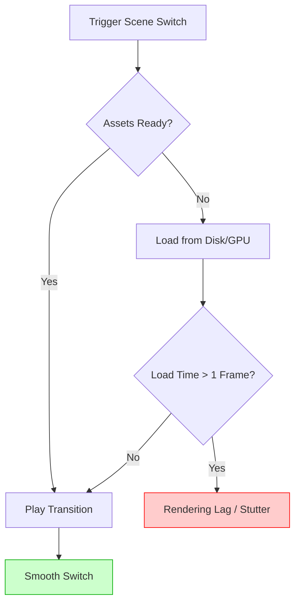

## The "Vibe Killer" Lag

You’re crushing a game on TikTok Live. The energy is high. You hit your stream deck to switch to your "Just Chatting" scene to talk to chat—and everything freezes.

For 3 seconds, your face is stuck in a weird expression. The audio continues, but the video is dead. By the time it catches up, the moment is gone.

This is **Scene Switching Lag**, and for TikTok Live creators (where retention is measured in milliseconds), it’s a growth killer.

I saw a thread on r/OBS recently that nailed this frustration:
> *"Every time I switch from my Game scene to my Facecam scene, OBS stutters and TikTok shows a 'poor connection' warning for a split second. My internet is fine (1Gb fiber). What gives?"*

It’s almost never your internet. It’s your **rendering pipeline**.

Here is the technical breakdown of why this happens and how to fix it immediately.

## The Diagnostic: Where is the Bottleneck?

When you switch scenes, OBS has to do three things instantly:
1.  **Unload** the assets from Scene A (if configured to do so).
2.  **Load** the assets for Scene B (webcams, overlays, alerts).
3.  **Render** the transition effect (Stinger/Fade) on top of it all.

If any step takes longer than 16ms (for 60fps), you drop frames.

### What this diagram shows
The Scene Switch Pipeline: Why "Loading" is usually the culprit behind lag, not your internet speed.

## Mistake #1: The "Close File When Inactive" Trap

This is the #1 cause of scene lag, and it’s enabled by default on many sources.

When you add a Media Source (like an animated background or overlay video), there is a checkbox: **"Close file when inactive"**.

*   **If CHECKED**: OBS unloads the file from memory when you leave the scene. When you switch back, it has to read it from your hard drive *from scratch*. This causes a massive CPU/Disk spike.
*   **The Fix**: Uncheck this box for any asset you use frequently (like your background loop or main overlay). Keep it in memory so it’s instant.

## Mistake #2: The Heavy Stinger Transition

You bought a fancy "4K 60fps WebM" stinger transition from a graphics shop. It looks cool, but it’s crushing your encoder.

TikTok Live requires vertical encoding (usually alongside your horizontal recording). Decoding a transparent, high-bitrate 4K WebM file *while* encoding two streams is often too much for a single GPU.

**The Fix**:
*   Re-render your stinger as a **MOV (ProRes 4444)** or a lighter **WebM**.
*   Downscale it to 1080p (or even 720p). TikTok is viewed on phones; 4K transitions are wasted resources.

## Mistake #3: Global Audio Devices vs. Scene Audio

If you add your microphone as a source inside *every single scene* instead of using "Global Audio Devices" in settings, OBS treats it as a "new" source every time you switch.

This can cause a split-second audio dropout or "pop" during the switch.

**The Fix**:
*   Go to **Settings > Audio**.
*   Set your Mic/Aux to your microphone.
*   Remove the individual "Audio Input Capture" sources from your scenes (unless you have a specific reason for them).

## The "Smooth Switch" Checklist

Before your next stream, run this 2-minute audit:

1.  **Memory Check**: Go through every "Media Source" in your main scenes. Uncheck "Close file when inactive".
2.  **Browser Sources**: If you use heavy browser sources (like complex alerts), check "Refresh browser when scene becomes active" ONLY if they are buggy. Otherwise, leave it off to keep them loaded.
3.  **Simplify Transitions**: Switch your Transition to "Cut" or "Fade" temporarily. If the lag stops, your Stinger was the problem.
4.  **Match Resolution**: Ensure all your video assets match your canvas resolution. Don't make OBS scale a 4K camera down to 1080p *during* the render pass if you can crop it beforehand.

## FAQ

**Q: Will "Studio Mode" help with this?**
A: Yes and no. Studio Mode allows you to *preview* the scene before switching, which can pre-load assets in the preview window. However, the actual "Transition" load still happens when you click "Transition". It helps you catch the lag before the audience sees it, but it doesn't solve the root resource usage.

**Q: Is this related to my bitrate?**
A: Rarely. Bitrate issues usually cause constant lag, not specific spikes when switching scenes. If it *only* happens when switching, it's a local rendering issue, not a network upload issue.

**Q: My CPU usage spikes to 100% when I switch. Why?**
A: You likely have a complex "Scene Collection" transition or a massive script running. Check your logs (Help > Log Files > Analyze Current Log) to see if a specific source is throwing errors.

## Conclusion

TikTok Live is fast-paced. You don't have the luxury of "dead air" or technical pauses.

Your scenes should be lightweight, pre-loaded, and instant. Stop asking your PC to fetch files from the hard drive in the middle of a clutch moment. Keep them in RAM, keep them ready, and keep the vibe alive.
