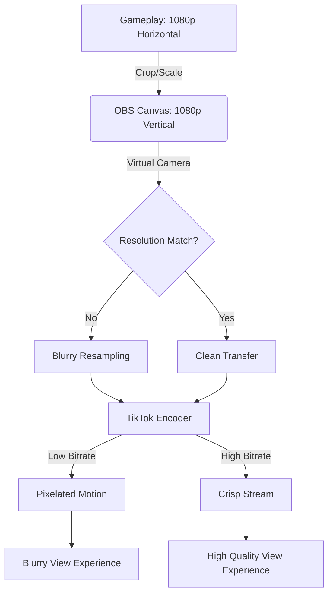

> Source discussion: "OBS stream looks blurry on TikTok Live" — r/obs. Creators frequently report that while their OBS preview looks perfect, the actual TikTok Live feed appears pixelated, especially during high-motion gameplay.

---

## The "Perfect Preview" Paradox

You’ve spent hours perfecting your OBS layout. Your face cam is sharp, your gameplay is fluid, and your OBS "Stats" window shows zero dropped frames. But when you open your own stream on a phone, it looks like a 240p video from 2008.

This is the most common frustration for TikTok streamers. The problem isn't usually your hardware or your internet speed—it's a breakdown in how data is handed off from OBS to TikTok's servers.

## Why "Good" Settings in OBS Fail on TikTok

To understand the fix, we have to look at the three hidden bottlenecks that kill image quality during the vertical streaming process.

### 1. The Resolution Mismatch (The Scaling Trap)
Most gamers play in 16:9 (1920x1080). TikTok is 9:16 (1080x1920). If you are using a standard horizontal OBS profile and simply "fitting" it into TikTok Live Studio via Virtual Camera, you are likely downscaling your gameplay to fit the width, then TikTok is upscaling it to fit the vertical height. This double-scaling creates "blur" before a single frame is even encoded.

### 2. The Virtual Camera Bottleneck
The OBS Virtual Camera is a lifesaver, but it isn't magic. It acts as a bridge, but if your OBS Canvas resolution doesn't match the TikTok Live Studio input resolution *exactly*, the Virtual Camera driver has to perform real-time resampling. This adds CPU overhead and often introduces slight blurring to fine text and HUD elements.

### 3. Bitrate vs. Motion Complexity
TikTok Live Studio often defaults to a "Balanced" or "Smooth" setting that caps your bitrate surprisingly low (sometimes as low as 2000-3000 kbps). While 3000 kbps is plenty for a static "Just Chatting" stream, it is nowhere near enough for a fast-paced shooter like Fortnite or Call of Duty at 60 FPS. When the bitrate is too low for the amount of movement on screen, the encoder "smudges" pixels together to keep up, resulting in that classic "blocky" blur.

## The Core Insight: Match the Canvas, Not the Crop

The secret to a crisp TikTok stream isn't higher numbers—it's **Native Verticality**.

Each time you ask a piece of software to "resize" your video, you lose detail. To fix the blur, you must ensure that every step of the chain—from your OBS Canvas to the TikTok ingest—is using the exact same pixel dimensions.

---

## Step-by-Step: The "Crisp Stream" Configuration

Follow these steps to eliminate the blur and get 1080p-quality visuals on TikTok.

### 1. Set Your OBS Canvas to Native Vertical
Don't use a horizontal canvas and crop it. Create a dedicated **Vertical Profile** in OBS.
- Go to **Settings > Video**.
- **Base (Canvas) Resolution**: 1080x1920.
- **Output (Scaled) Resolution**: 1080x1920.
- **Downscale Filter**: Not applicable (since they match), but set to **Lanczos** just in case.
- **FPS**: 60 (or 30 if your PC is struggling).

### 2. Use the Aitum Vertical Plugin (Recommended)
If you want to stream to Twitch (Horizontal) and TikTok (Vertical) simultaneously, use the **Aitum Vertical Plugin**. It creates a secondary vertical canvas within OBS that runs its own encoder, bypassing the need for the Virtual Camera bridge and its associated quality loss.

### 3. Optimize Your TikTok Live Studio Ingest
If you *must* use TikTok Live Studio with OBS Virtual Camera:
- In **TikTok Live Studio**, add a "Camera" source.
- Select **OBS Virtual Camera**.
- Click the **Settings (gear icon)** on the camera source and ensure the resolution is set to **1080x1920**. If it's set to "Auto," it may be defaulting to 720p.

### 4. Force a Higher Bitrate
In TikTok Live Studio settings:
- Go to **Streaming Quality**.
- Select **Custom**.
- Set **Bitrate** to at least **6000 kbps** (if your upload speed is 15Mbps or higher).
- Set **Encoder** to **NVENC (NVIDIA)** or **AMF (AMD)** to offload the work from your CPU.

---

## Visualizing the Quality Loss

*This diagram shows the two critical points where quality is lost: the handoff to the Virtual Camera and the final encoding bitrate. If either "No" or "Low Bitrate" paths are taken, the result is a blurry stream.*

---

## Verification: How to Test Your Quality

1.  **The "Text Test"**: Open your game's settings menu or a chat window. If the small text is unreadable on the TikTok stream but clear in OBS, your resolution/scaling is the problem.
2.  **The "Spin Test"**: In-game, spin your character in a circle. If the image turns into a "blocky" mess, your bitrate is too low for your FPS.
3.  **Check Stream Health**: In TikTok Live Studio, click the "Stream Health" icon. If you see "Network Fluctuations," your bitrate is too high for your internet. If you see "Encoder Overload," your settings are too high for your PC.

## When This Won't Work
If you are streaming from a phone using "Screen Cast" or a mobile data connection, these OBS fixes won't apply. This guide is specifically for PC creators using OBS to power their TikTok Live presence.

By aligning your resolutions and giving your encoder enough "room to breathe" with a proper bitrate, you'll move from a blurry mess to a professional-grade broadcast.
