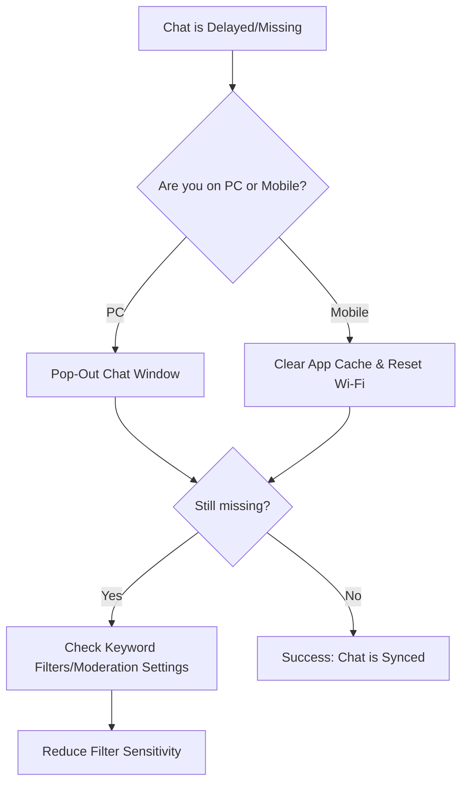

## The "Ghost Chat" Frustration

There is nothing more awkward for a TikTok creator than a viewer saying, "Why are you ignoring me?" when their message never even appeared on your screen. Chat delays and missing comments are two of the most common technical hurdles on TikTok Live, often leading to lost gifts and lower retention.

If your chat feels "slow" or you only see messages when you look at a second device, you are likely dealing with a **sync or filtering issue**.

---

## Root Cause: Why Is Chat Failing?

Chat issues usually fall into three categories:

1.  **Server-Side Filtering (Shadow Filtering)**: TikTok uses aggressive AI to filter "spam" or "inappropriate" content. Sometimes, perfectly normal messages are caught in this net and never shown to the creator, even if the viewer thinks they sent it.
2.  **App Cache & Bloat**: On mobile, the TikTok app stores massive amounts of temporary data. When this cache becomes corrupted, the "Live Stream" module (which is essentially a web-view) fails to refresh the chat feed in real-time.
3.  **TikTok Live Studio Socket Timeout**: On PC, the Studio app connects to a chat "socket." If your network has even a micro-drop in connection, the socket can hang. The video keeps playing, but the chat feed stops updating.
4.  **Device Desync**: Many creators use a "Monitor" device (phone) while streaming from PC. If the phone is on a different Wi-Fi band (2.4GHz vs 5GHz), it can be 5–10 seconds behind the actual live feed.

---

## Core Insight: The "Pop-Out" Reliability

If you are using TikTok Live Studio, the built-in chat window is often the first thing to fail during a high-traffic stream.

### One Paragraph Insight
The most reliable way to ensure you never miss a message in TikTok Live Studio is to use the **Pop-Out Chat** feature. By popping the chat out into its own window, you force the app to create a dedicated process for the comment feed, which is less likely to freeze than the integrated "Dashboard" view.

---

## Step-by-Step Solutions

### 1. The Mobile "Clear & Reset" (Fix for Phone)
If you stream from your phone and chat is missing:
*   **Clear Cache & Downloads**: Go to Settings and Privacy > Free up space > Clear Cache AND Clear Downloads.
*   **Toggle "Filtered Comments"**: In your Live settings (before going live), ensure "Filter Keyword" and "Review Community Flags" aren't set too strictly. High sensitivity will hide 30% of your chat.

### 2. The Studio "Socket Refresh" (Fix for PC)
If the chat stops moving in TikTok Live Studio:
*   **Pop-Out Chat**: Click the "Pop-out" icon in the top right of the chat panel.
*   **Toggle the "Interaction" Tab**: Sometimes simply switching from the "Chat" tab to the "Gifts" tab and back forces a refresh of the socket.
*   **DNS Flush**: Open Command Prompt as Admin and type `ipconfig /flushdns`. This clears old network paths that might be causing the chat socket to hang.

### 3. The "Lurker" Check
If you suspect you are missing messages, ask a trusted moderator or friend to send a "Test" message with a specific emoji. If they see it but you don't, your **Keyword Filter** is likely the culprit.

---

## Troubleshooting Decision Flow

### What this diagram shows
This guide helps you prioritize the most common fixes based on your platform. PC users should almost always start with the "Pop-Out" method, while mobile users need to focus on app "cleanliness."

---

## Verification & Practical Checks

### The "Double-Device" Sync
Always have a second device (phone or tablet) logged into a **different account** (a "Lurker" account) to watch your own stream.
*   If the chat on your Lurker device matches your Streaming device, the delay is **Network-wide**.
*   If the Lurker device shows messages that your Streaming device doesn't, the issue is **App-specific** (Cache or Socket).

### Bitrate vs. Chat
If your upload speed is struggling, TikTok will prioritize **Video Data** over **Chat Data**. If your chat is consistently delayed, try lowering your bitrate by 500kbps to give the "Chat Socket" more breathing room.

**Pro Tip**: Don't use 3rd-party chat overlays (like Tikfinity or Streamlabs) as your *only* source of truth. They are often 2–5 seconds slower than the native TikTok chat. Use them for the "look," but keep the native chat open for the "speed."
