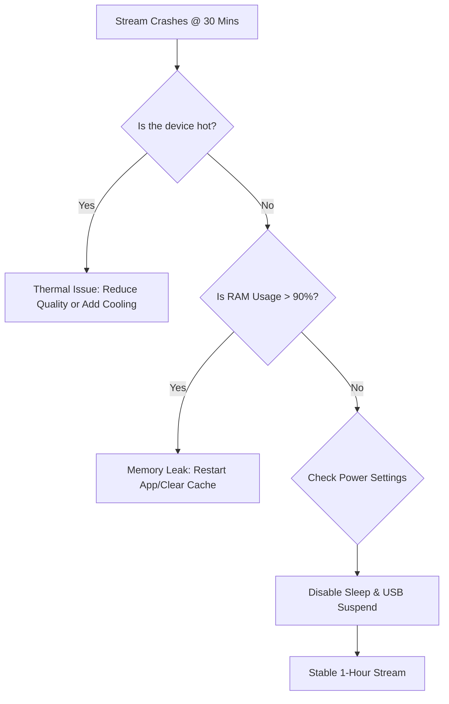

## The "30-Minute Wall" Problem

For many creators, the first 20 minutes of a TikTok Live are perfect. But as you approach the 30-minute mark, the app starts to stutter, the audio desyncs, and finally, the entire session crashes. 

This isn't just a random bug; it's a symptom of a system that is struggling to keep up with the high demands of live encoding. If your stream consistently dies at the same time, you are likely hitting a **resource or thermal ceiling**.

---

## Root Cause Analysis: Why 30 Minutes?

The 30-minute mark is a "sweet spot" for several technical failures to converge:

1.  **Thermal Soak**: It takes about 20–30 minutes for your GPU or phone processor to reach its maximum heat. Once it hits a certain threshold, the system throttles performance to protect itself, causing the app to crash.
2.  **Memory Leaks (RAM)**: TikTok Live Studio is notoriously resource-heavy. If the app has a memory leak, it will slowly consume your RAM until the OS forcefully closes it to prevent a system-wide crash.
3.  **ISP Session Refresh**: Some internet service providers refresh DHCP leases or session tokens at fixed intervals. If your network hardware isn't handling the handshake quickly, the stream drops.
4.  **Power Saving Policies**: Windows and mobile OS often have "Sleep" or "Efficiency" modes that trigger after 30 minutes of "inactivity" (even if you are streaming, if you haven't moved the mouse on the *host* machine, it might try to sleep).

---

## Core Insight: Resource Buffer vs. Real-Time Demand

Success in long-form streaming requires a "Performance Buffer." If your PC is running at 95% capacity the moment you start, it will inevitably fail once heat and memory pressure build up over 30 minutes.

### One Paragraph Insight
A stable stream isn't about having the fastest hardware; it's about having **overhead**. If your GPU usage is above 80% in TikTok Live Studio, you are in the "Danger Zone." Over 30 minutes, that high usage leads to a "Thermal Cascade" where the system slows down, causing the software to hang and eventually crash.

---

## Step-by-Step Solutions

### 1. Fix for PC (TikTok Live Studio)
*   **Lower GPU Priority**: Go to Windows Settings > Gaming > Game Mode > Graphics. Find TikTok Live Studio and set it to "Power Saving" or manually cap the frame rate in your GPU control panel.
*   **Disable Compatibility Layers**: Right-click the TikTok Live Studio shortcut > Properties > Compatibility. Ensure "Run this program in compatibility mode" is **unchecked**.
*   **Clear App Cache**: Close the app, press `Win + R`, type `%localappdata%`, find the TikTok Live Studio folder, and clear the `Cache` folder.

### 2. Fix for Mobile
*   **Remove the Case**: Modern phones dissipate heat through the back panel. A case acts as an insulator, leading to thermal crashes at the 30-minute mark.
*   **Disable "Auto-Brightness"**: This reduces the screen's power draw and heat generation.
*   **Use a Cooling Fan**: If you stream high-quality gaming, a clip-on phone cooler is mandatory for sessions longer than 20 minutes.

---

## Stability Decision Flow

### What this diagram shows
This flowchart helps you isolate whether your crash is hardware-based (Heat/RAM) or software-based (Power/Settings). Most users will find they land in the "Thermal" or "RAM" categories.

---

## Verification: The "Stability Stress Test"

Before your next "Real" live, run a **Private/Test Stream**:
1.  Open TikTok Live Studio and set it to the lowest possible bitrate.
2.  Let it run for 40 minutes without any gaming/heavy apps.
3.  If it *doesn't* crash, the issue is **Hardware Overload** (your PC can't handle the game + the stream).
4.  If it *still* crashes, the issue is **Software/Network** (reinstall the app or check your router logs).

**Pro Tip**: Always run TikTok Live Studio as **Administrator**. This gives the app higher priority for system resources, preventing the OS from "backgrounding" it and causing a timeout crash.
