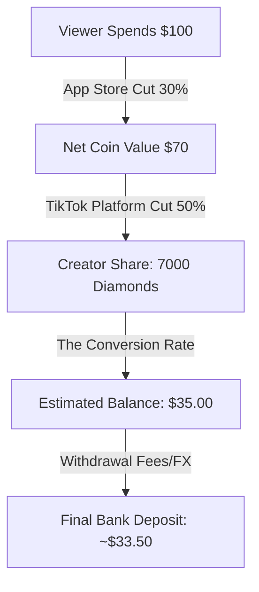

> Source discussion: "TikTok Live payout seems incorrect" — r/TikTokLive. Creators often express frustration when their estimated earnings don't match their bank deposits, leading to accusations of "missing money" or hidden fees.

---

## The "Missing Money" Mystery

You just finished a massive Live. You saw the gifts flying—Roses, Galaxys, maybe even a Lion. Your "Estimated Diamonds" count is in the thousands. You do some quick mental math, wait for the payout, and... it’s significantly lower than you expected. 

The immediate reaction is often: *"TikTok is stealing from me."* 

But before you file a support ticket, you need to understand that TikTok's payout system is a complex sequence of conversions, commissions, and third-party fees. What feels like "missing money" is usually just the reality of the platform's math.

---

## The Root Cause: The Three-Step Dilution

The confusion stems from a misunderstanding of how a viewer's dollar becomes a creator's cent. There are three specific stages where your earnings are "diluted."

### 1. The Coin-to-Gift Markup
Viewers buy **Coins**. TikTok charges different rates depending on where they buy them (App Store vs. Website). If a viewer buys coins on an iPhone, Apple takes a 30% cut *before* TikTok even sees the money. This means the "value" of a gift is already skewed before it hits your screen.

### 2. The 50% Platform Commission
This is the big one. TikTok takes roughly **50%** of the net value of the gifts sent to you. When you receive a gift, TikTok converts its Coin value into **Diamonds**. The Diamond count you see in your analytics is *already* the net amount after TikTok has taken its cut. 

### 3. The Diamond-to-USD Fixed Rate
This is where the math trips people up. **1 Diamond does not equal 1 Cent.** 
The fixed payout rate is **1 Diamond = $0.005 USD** (half a cent). 
If you have 10,000 Diamonds, you don't have $100. You have $50.

---

## Core Insight: Diamonds Are "Net," Not "Gross"

The most important realization for any creator is this: **Diamonds are a representation of your share, not the total value of the gift.**

When you see "10,000 Diamonds" in your balance, that is the amount *after* TikTok’s 50% commission has been removed. You do not need to subtract another 50% from that number. However, you *do* need to account for withdrawal fees and currency exchange rates, which occur *after* you hit the "Withdraw" button.

---

## Step-by-Step: Calculating Your Real Payout

Stop guessing and start calculating. Use this flow to find your actual expected deposit.

### 1. The "Half-Cent" Formula
Take your total Diamond count and multiply by 0.005.
*   **Example**: 5,000 Diamonds × 0.005 = **$25.00 USD**.

### 2. Factor in the "Withdrawal Tax"
When you move money from TikTok to PayPal or a bank account:
- **PayPal**: Usually charges a flat fee or a small percentage (often $0.10 - $1.00 depending on the region).
- **Exchange Rates**: If you are outside the US, TikTok pays in USD. Your bank or PayPal will convert this to your local currency (GBP, EUR, CAD) using *their* exchange rate, which is always lower than the market rate. This can "lose" you another 3-5% of your total.

### 3. Check for "Settlement Delay"
Earnings from a Live don't settle instantly. 
- **Estimated Diamonds**: Shown during the stream (unverified).
- **Total Balance**: Updated within 24-48 hours after the stream ends.
- **Withdrawal History**: Always check this tab to see if a specific payout was split or delayed due to "Review."

---

## Visualizing the Payout Pipeline

*This diagram illustrates why a $100 purchase by a fan results in roughly $33 in your pocket. The "incorrect" feeling usually comes from looking at the viewer's spend instead of the Diamond conversion.*

---

## Verification: How to Spot a Real Error

While most "incorrect" payouts are just math, actual errors *do* happen. Here is how to verify:

1.  **The Screenshot Audit**: Take a screenshot of your "Diamonds Earned" at the end of every stream.
2.  **The Math Check**: 48 hours later, go to **Settings > Balance > Live Rewards**. Does the "Total Diamonds" increase by the amount in your screenshot?
3.  **The Withdrawal Log**: If the numbers match in the app but not in your bank, the issue is your **Payment Method** (PayPal/Bank), not TikTok. Check your transaction history for "Service Fees."

### When to Contact Support
If your Diamond count in the "Balance" tab is lower than the "Diamonds Earned" in your Live Analytics after 72 hours, this is a technical glitch. Submit a ticket with screenshots of both screens.

By understanding that 1 Diamond = $0.005 and accounting for the 50% platform cut, you can manage your expectations and treat your TikTok Live as the business it actually is.
