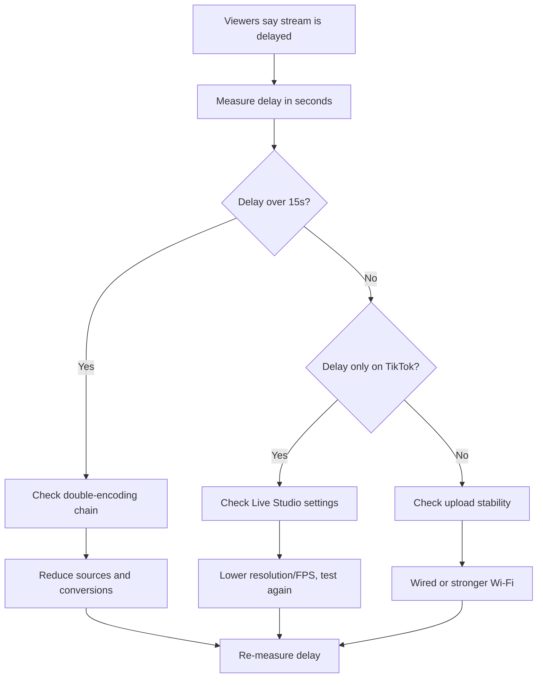

## TL;DR

If your TikTok Live is delayed, you’re stacking buffers (capture → encoder → network → TikTok). Measure the delay first, then remove the biggest buffer in the chain.

## Introduction

This is the TikTok Live problem that makes you feel helpless because it’s not “laggy.” It’s just… behind.

You react to a play, you say “no shot,” and chat replies 10 seconds later like they’re watching a different timeline. Or your co-host is talking to you on Discord and you realize your stream is way behind real time.

On r/TikTokLive, the replies to this problem usually split into three camps:

- One group says “TikTok always has delay, accept it.”
- Another group blames your internet (even when you’re on fiber).
- A third group points at the real culprit: your setup is double-processing or buffering somewhere (Live Studio + OBS, capture card buffering, unstable upload causing platform-side buffering).

This guide is a step-by-step checklist to find which one is true for you.

## Step 0: Confirm It’s Stream Delay (Not Frame Drops)

Delay and lag get mixed up a lot.

- **Lag / stutter**: the video freezes, drops frames, or looks choppy.
- **Delay / latency**: the video is smooth, but it’s behind by seconds.

If your stream is smooth-but-behind, continue. If it’s choppy, fix stability first (bitrate, FPS, encoder overload).

## Step 1: Measure Your Actual Delay (60 Seconds, No Guessing)

You need a number.

### The “Clock Test” (best)

1. Open a digital clock with seconds on your streaming device (or a browser tab).
2. Go Live.
3. Watch your Live on a second phone (not on the same Wi‑Fi if possible).
4. Compare the seconds shown on-screen vs what the viewer device shows.

Write down the delay: 3s? 8s? 25s?

### What the number means

- **2–6 seconds** is common platform latency.
- **7–15 seconds** usually means extra buffering (encoding or network).
- **15–30+ seconds** is almost always a “buffer stack” problem (double-encoding, unstable upload, or a capture chain adding delay).

## Step 2: Identify Your Pipeline (Where Delay Gets Added)

Your fixes depend on how you go Live:

- **Mobile camera**: TikTok app → TikTok servers → viewers.
- **TikTok Live Studio**: Live Studio → TikTok servers → viewers.
- **OBS into Live Studio (Virtual Camera / Capture)**: OBS → virtual/capture → Live Studio → TikTok servers → viewers.
- **OBS direct ingest (stream key / approved workflow)**: OBS → TikTok servers → viewers.

The “OBS into Live Studio” setup is the most likely to stack extra delay because you’re asking two apps to process video.

## Step 3: Use This Decision Flow to Find the Bottleneck

### What this diagram shows

This flow keeps you from “trying everything.” If your delay is huge, treat it like a buffer stack. If it’s small but annoying and only happens on TikTok, treat it like an ingest/settings mismatch.

## Step 4: Fix the Three Most Common Causes

### Cause A: Double-encoding (OBS → Live Studio)

This is the most common “my stream is smooth but 20 seconds behind” setup.

What’s happening: OBS renders and buffers frames, then Live Studio captures that output and re-encodes it. If either app adds a safety buffer, they stack.

Fixes to try (in this order):

1. **Simplify the chain**: if you have a stream key / approved direct ingest, go OBS → TikTok directly.
2. **Reduce processing**: lower Live Studio output to 720p30 temporarily and re-measure.
3. **Reduce OBS render load**: disable heavy filters (background removal, motion blur, multiple browser sources) and re-measure.

### Cause B: Upload instability (platform buffers you)

If your upload isn’t stable, TikTok will buffer more to protect viewer playback. This often shows up as “it starts fine, then gets more delayed over time.”

Fixes:

1. Use wired Ethernet if you can.
2. If you’re on Wi‑Fi, move closer to the router and stop other uploads on the network.
3. Lower bitrate by 20–30% and re-test.

### Cause C: Capture/camera chain adds delay

Some capture paths buffer more than people realize (certain capture cards, wireless casting, virtual devices).

Fixes:

1. Prefer a direct wired camera/capture path over wireless casting.
2. If you use a capture card, check if it has a “buffer” or “latency” mode in its utility and set it to low-latency.
3. Keep your capture resolution simple (720p/1080p) and avoid unnecessary scaling inside Live Studio.

## Step-by-Step Checklist (Do This Before Your Next Live)

1. Measure the delay with the Clock Test and write the number down.
2. Lower output to 720p30 for one test stream.
3. Remove one conversion step (avoid OBS → Live Studio if possible).
4. Use wired Ethernet (or strongest Wi‑Fi possible).
5. Drop bitrate 20–30% and re-measure.
6. Remove heavy sources (browser sources, filters), then re-measure.

If your delay drops from 20s → 6s, you found the real bottleneck. Add things back one at a time.

## FAQ

### Is TikTok Live delay normal?
Some delay is normal. If you’re in the 2–6 second range, you’re likely seeing platform latency. If you’re at 15–30 seconds, something in your setup is buffering hard.

### Why is my TikTok Live delayed but the video looks smooth?
Because this is not a “frame drop” problem. It’s a “buffer” problem. Smooth playback is exactly what buffering is designed to preserve.

### Why does my stream get more delayed the longer I’m live?
That’s a classic sign of upload instability or a chain that slowly accumulates buffer. Treat it like a stability problem first (wired, lower bitrate), then simplify the pipeline.

### Does lowering FPS reduce delay?
It can. Lowering FPS reduces encoding workload and can reduce buffering if your system is near its limits. Use it as a diagnostic: test 30 FPS, measure, then decide if you need to stay there.

## Practical Conclusion

Don’t argue with chat about whether delay is “normal.” Measure it, then remove the biggest buffer in your chain. Once you can consistently hold 2–6 seconds, you’re in the “normal TikTok” zone, and you can focus on content instead of fighting your pipeline every stream.

