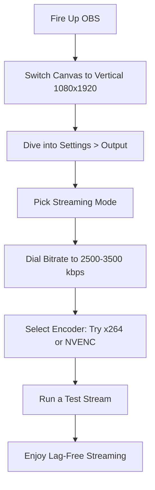

> Source discussion: "How to stream to TikTok using OBS?" — r/obs. Creators were struggling with TikTok Live bitrate caps, vertical canvas setup, and virtual camera quality.

---

## TL;DR

Quick heads-up: The wrong bitrate in OBS turns your TikTok Lives into a laggy mess. Bump it to 2500-3500 kbps, follow these tweaks, and watch your streams run buttery smooth.

## Introduction

Hey, if you're like me, you've probably scrolled through r/OBS and seen tons of posts about TikTok Live streams going haywire – lagging, dropping, you name it. A big culprit? Using the wrong bitrate settings that work fine for Twitch but bomb on TikTok. Inspired by threads like "How to stream to TikTok using OBS?" where streamers share their battles with virtual cameras and audio glitches, I'll show you step-by-step how to nail your bitrate for hassle-free lives in 2025.

## Actionable Steps

Check out this handy flowchart to get your OBS bitrate dialed in for TikTok – it's a game-changer.

This little diagram breaks it down simply – stick to it, and you'll match TikTok's specs without a hitch.

1. Kick things off by tweaking your canvas. Go vertical with 1080x1920 in OBS to fit TikTok perfectly. No more weird crops messing up your vibe.

2. Head to output settings. Navigate to Settings > Output > Streaming and set that bitrate between 2500 and 3500 kbps. Steer clear of those high Twitch numbers like 6000+ – they'll just tank your connection on TikTok.

3. Pick your encoder wisely. If your CPU is solid, go with x264. For GPU power, NVENC is your friend. Give both a spin to see what looks crispest.

4. Link up with TikTok Live Studio. Fire up the OBS Virtual Camera there, and set audio monitoring to 'Monitor Off' to dodge any annoying echoes from the comments.

5. Always test it out. Do a quick stream, watch for glitches, and tweak as needed based on what TikTok throws back at you.

## FAQ / Notes

Ever wondered why high bitrate tanks your stream? Simple – TikTok's limits are tighter than Twitch's, so pushing too hard causes drops.

Thinking about multi-streaming with these settings? You bet, just snag a plugin like obs-multi-rtmp to tweak bitrates per platform.

Pro tip: Test your upload speed first. Shoot for 5 Mbps or more to keep 3000 kbps flowing smoothly.

## Conclusion

There you go – nail that bitrate, and your TikTok Live sessions will flow without a hitch. You'll ditch the tech headaches and dive straight into creating awesome content. Try these tips today and make your 2025 streams unstoppable!
