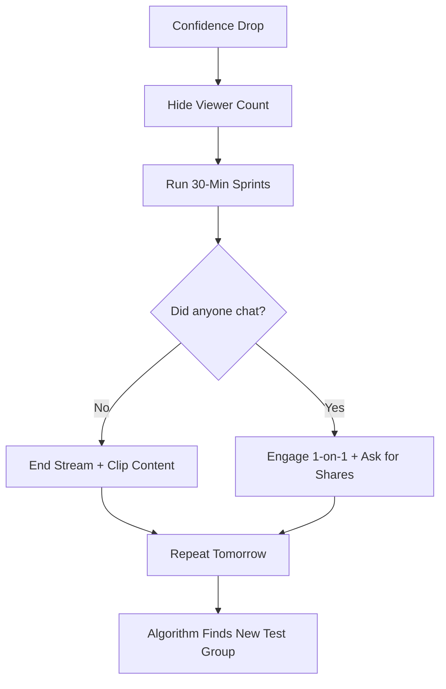

## The Silent Room Problem

You had a great stream last week. 50 viewers, active chat, and a few new followers. You felt on top of the world. Then, you went live today and... nothing. Two viewers. Both bots. No one is talking. 

When your TikTok Live performance drops off a cliff, it doesn't just hurt your stats; it hits your confidence. You start questioning your personality, your setup, and whether you’re "cut out" for this. This "Confidence Crash" is the number one reason small streamers quit TikTok just before they hit their stride.

---

## Root Cause: The Volatility of Discovery

The biggest misconception for small streamers is that view counts are a direct reflection of their quality. On platforms like Twitch, you build a "base" that stays with you. On TikTok, every stream is a fresh experiment by the algorithm.

### Why Expectations Diverge
TikTok is a discovery engine, not a community platform. It pushes your Live to a "test group" of viewers on the For You Feed. If that specific test group happens to be distracted, busy, or just not into your niche at that exact moment, the algorithm throttles the reach. 

This creates a **Volatility Loop**:
1. High views (Algorithm test succeeds) -> High Confidence.
2. Low views (Algorithm test fails) -> Anxiety -> Worse Performance.
3. Creator quits or changes everything, confusing the algorithm further.

---

## Core Insight: Views are a Test, Not a Reward

Stop looking at your view count as a grade on your performance. 

### One Paragraph Insight
The TikTok algorithm doesn't "reward" you with views for being a good streamer; it "tests" you with views to see if you can keep people on the platform. When your views drop, it isn't a signal that you’ve failed; it’s a signal that the current "test group" didn't engage. The fix isn't to change who you are; it’s to remain consistent enough for the algorithm to find the *right* test group.

---

## Step-by-Step Confidence Rebuild

If your confidence has taken a hit, follow this recovery plan to get back into the flow.

### 1. The "Blindfold" Technique
*   **Hide the Viewer Count**: In TikTok Live Studio or on your phone, cover the viewer count with a physical sticky note or a piece of tape. 
*   **Why it works**: You cannot perform for a number you can't see. You are forced to treat the "room" as if it’s full, which ironically makes the algorithm more likely to push your stream because your energy remains high.

### 2. The 30-Minute Sprint
*   **Set a Hard Limit**: Commit to only 30 minutes. 
*   **Action**: Go live, give it 100% energy for exactly 30 minutes, and end it—regardless of the numbers.
*   **Why it works**: Long, empty streams are confidence killers. Short, high-energy sprints prevent the "fatigue of the silent room."

### 3. The "Personality Anchor"
*   **Identify One Hook**: Choose one thing you do uniquely (a specific game challenge, a weird light setup, a catchphrase).
*   **Focus**: Talk *about* that hook constantly, even to zero viewers.
*   **Why it works**: It gives you a script to follow so you aren't left staring at a blank screen waiting for a comment to prompt you.

---

## The Momentum Recovery Flow

### What this diagram shows
This loop shifts your focus from "Why is no one here?" to "What can I control?" By ending the stream early when it's quiet and using that time to make clips, you turn a "failed" stream into a content win.

---

## Verification & Practical Checks

### How to Know it's Working
You aren't looking for a "viral" stream yet. You are looking for **Internal Verification**:
*   **The "Vibe Check"**: Do you feel energized after 30 minutes instead of drained?
*   **The "Clip Test"**: Can you find at least 60 seconds of high-energy footage from your 30-minute sprint? If yes, you are winning.

### When the Solution Does NOT Apply
If you have **violations** on your account (check "Account Standing" in Creator Tools), no amount of confidence will fix your views. The algorithm is physically restricted until the violation expires. In this case, focus on posting high-quality short-form videos to "warm up" your account again.

### Edge Case: The "Hate Raid"
If your confidence dropped because of a negative comment, remember: **Engagement is Engagement**. TikTok doesn't differentiate between a "Hate Comment" and a "Love Comment" when calculating reach. Block the user, thank them for the boost in the algorithm, and keep moving.
