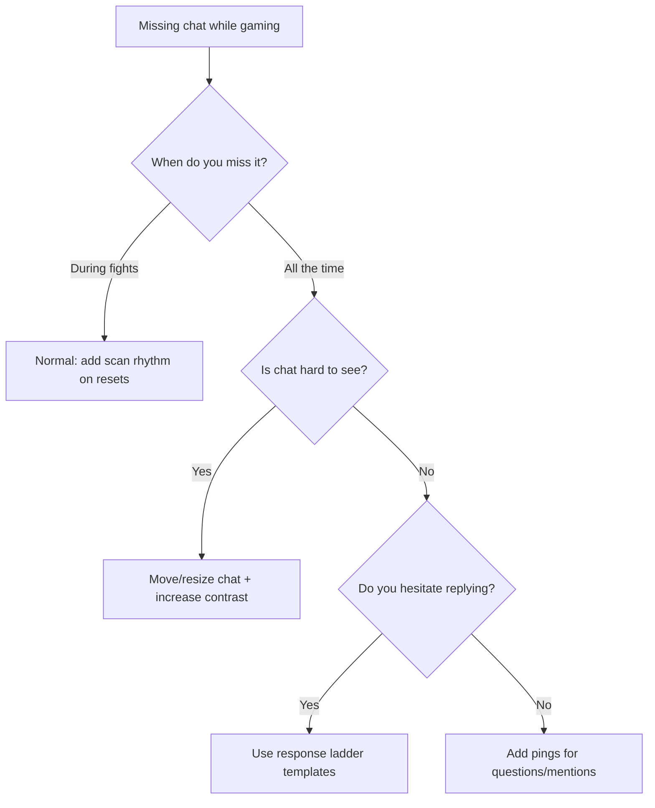

## TL;DR

Multitasking chat and gameplay is hard because you’re asking your brain to do two real-time tasks at once. Fix it by using (1) a repeatable chat scan rhythm, (2) a response ladder for fast replies, and (3) small setup changes that reduce eye travel and decision fatigue.

## Introduction: The “I’m Playing… But I’m Not Streaming” Feeling

If you’ve ever ended a stream and realized you barely spoke, missed half the messages, and felt guilty about it, you’re not broken. You’re overloaded.

Creators in r/gamestreaming describe the same loop:

- focus on the fight
- miss chat
- glance at chat and feel behind
- try to catch up and die in-game
- stop looking at chat again

The solution isn’t more willpower. It’s a system that makes chat interaction predictable, lightweight, and timed to moments your gameplay already has.

## Why This Happens (In One Sentence)

High-intensity games already consume most of your attention budget, so reading + understanding + responding to chat becomes “context switching,” which is expensive and makes you feel slower at both.

## The Attention System (3 Parts)

### Part 1: A “Scan Rhythm” That Matches Your Game

Most streamers fail here because they scan randomly. Random scanning equals random misses.

Pick one rhythm based on your game type:

- **Competitive FPS / BR**: scan on resets (spawn, reload, rotate, buy phase, death cam)
- **MOBA / ARPG**: scan after you clear a wave / pack
- **Soulslike / roguelike**: scan after every room or checkpoint
- **Cozy / sim**: scan on every interaction menu

The key rule: don’t scan when the game needs micro-reactions. Scan when the game naturally gives you a half-second.

### Part 2: A “Response Ladder” (So You Don’t Freeze)

Missing chat is painful. Freezing because you don’t know what to say is worse.

Use a 4-step ladder:

1. **Acknowledge**: “Yo I see you.”
2. **Answer fast**: one sentence, no essay.
3. **Bridge back**: connect it to what’s happening on screen.
4. **Invite**: one tiny question.

Example in real time:

- “Yo, good question. I’m running this loadout because it wins close fights. Watch this rotate. What do you run on this map?”

This keeps you interactive without derailing gameplay.

### Part 3: “Friction Reduction” Setup (So You Don’t Need Hero Focus)

This is the boring part that makes everything easier:

- put chat where your eyes already go (near minimap / crosshair dead zone)
- make chat bigger than you think you need
- use high-contrast text and fewer colors
- enable sound/visual pings for mentions and questions (not every message)

If your eyes have to travel far, you’ll scan less. If your chat is hard to read, you’ll avoid it.

## The 60-Second Diagnosis: What’s Actually Breaking?

This diagram shows the fastest fix path: separate “expected misses during combat” from “setup visibility” and “reply hesitation.” Each failure point has a different fix.

## Step-by-Step Checklist (Run This Before Your Next Stream)

### Step 1: Choose your scan moments (write them down)

Pick 3–5 moments you *promise* to scan chat. Examples:

- every death / respawn
- every loading screen
- every match start
- every time you open inventory

If it’s not written down, you’ll forget.

### Step 2: Set a “chat bandwidth” rule

Decide what you will prioritize:

- questions
- first-time chatters
- anyone you recognize (returners)

Everything else gets a quick “I see you” and you keep moving.

### Step 3: Prepare 6 response starters

Put these in your head like ammo:

- “Good question—here’s the short version…”
- “I’m testing something: I’m trying to…”
- “Chat, vote: A or B?”
- “If you’re new: we’re doing…”
- “After this round I’ll explain the setup.”
- “Hold on—fight first, then I’ll read.”

You’re not being fake. You’re reducing decision fatigue.

### Step 4: Use one “narration anchor” to stay talking

Pick one thing you narrate constantly:

- your next objective (“rotate, buy, reset, push”)
- your decision rule (“high ground first”)
- your mistake-correction (“what I should’ve done”)

Narration keeps lurkers engaged even when chat is quiet.

### Step 5: Add one “interaction mechanic” per stream

Examples that don’t ruin gameplay:

- “Every new follower = I switch weapon next life.”
- “Chat picks the next drop spot / route.”
- “If we win this round, chat chooses the next challenge.”

Do one. If you do five, you’ll drown.

## Common Mistakes (And the Fix That Actually Works)

### Mistake: Trying to read every message

Fix: read **patterns**, not every line. If three people ask the same thing, answer it once clearly.

### Mistake: Only looking at chat when you’re already behind

Fix: scan on schedule. Even a 2-second scan every minute beats a 45-second panic read.

### Mistake: Apologizing constantly for missing messages

Fix: set expectations once: “If I miss something mid-fight, ask again after the round.” Then move on.

## FAQ

### How do I read chat without dying in-game?

Stop trying to read chat during micro-reaction moments. Scan on resets (respawn, rotate, buy phase, loading screens) and use quick one-sentence replies.

### What if chat moves too fast?

Use a bandwidth rule: prioritize questions, first-time chatters, and returners. Everything else gets acknowledgement, not a full conversation.

### Do I need a second monitor to multitask chat and gameplay?

It helps, but it’s not required. The bigger win is reducing eye travel and building a scan rhythm. Even a phone or tablet positioned near your minimap zone can work.

### What if I’m a quiet streamer and talking makes me play worse?

Use a narration anchor that’s already in your head (objective, decision rule, mistake-correction). You’re not performing lines; you’re externalizing your thinking.

## Conclusion

If it’s hard to multitask chat and gameplay, don’t label it as a personality problem. Treat it like a system problem. Lock in a scan rhythm, use a response ladder, reduce friction with your setup, and your streams will feel calmer, more interactive, and easier to repeat.

