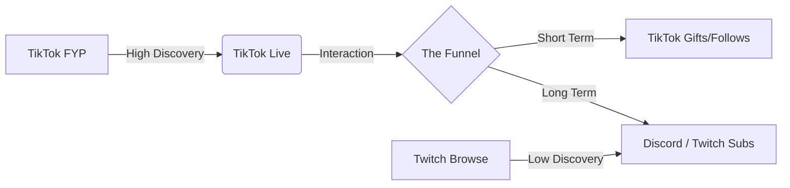

> Source discussion: "Is TikTok Live worth it for gamers?" — r/streaming. Creators are increasingly questioning Twitch's discovery algorithm and looking toward TikTok as a primary growth engine, despite its "janky" PC tools.

---

## The "Zero Viewer" Twitch Trap

You’ve been live for three hours. You’ve played your heart out, your OBS overlays are professional, and you’ve kept your energy high. You glance at your dashboard: **0 Viewers**. 

This is the standard experience for 90% of new streamers on Twitch. Because Twitch’s discovery is primarily based on viewer count (the "rich get richer" model), you are effectively invisible unless you bring an audience from elsewhere. This leads to the ultimate question: *Is it time to stop fighting the Twitch algorithm and move to TikTok Live?*

---

## The Root Cause: Discovery Logic vs. Community Depth

The debate isn't about which platform is "better," but rather how their algorithms treat a new creator.

### 1. TikTok's "Interruption" Discovery
On TikTok, people don't "find" your stream; the algorithm **pushes** it into their path. As users scroll their For You Page (FYP), your Live appears as a full-screen vertical video. This means you can get 50-100 unique viewers in your first hour without a single follower. 

### 2. Twitch's "Search" Discovery
On Twitch, users have to actively click on the "Gaming" category, scroll past the top 100 streamers, and find your name. It is a pull-based system that rewards existing communities but punishes new ones.

### 3. The "Jank" Factor
The trade-off for TikTok’s discovery is its software. TikTok Live Studio is unoptimized, often lacks native support for advanced OBS features, and forces a vertical (9:16) perspective that doesn't always suit horizontal gaming.

---

## Core Insight: TikTok is the Top of the Funnel

The most successful gamers in 2025 have stopped viewing TikTok as a "Twitch alternative" and started viewing it as the **Top of the Funnel**.

TikTok is for **Discovery** (finding new eyes). Twitch is for **Community** (deep engagement and high-value subs). If you only stream on Twitch, you have a community but no discovery. If you only stream on TikTok, you have discovery but struggle to build a long-term "home" for your fans.

---

## Step-by-Step: Decision Flow for Gamers

Should you make the jump? Follow this decision tree based on your current status.

### Scenario A: You are a New Streamer (0-50 Followers)
**Verdict: Go 100% TikTok (or Multistream).**
- Don't waste 20 hours a week on Twitch with 0 viewers.
- Use TikTok to build your first "core 100" fans. The immediate feedback from random viewers will help you improve your commentary and "on-camera" presence much faster.

### Scenario B: You Have a Small Community (50-500 Followers)
**Verdict: Multistream or "Twitch-First, TikTok-Second."**
- Use the **Aitum Vertical Plugin** in OBS.
- Stream your main content to Twitch, but use the plugin to send a vertical crop of your gameplay/face to TikTok simultaneously.
- Use TikTok as a "billboard" to invite people over to the Twitch "party."

### Scenario C: You Want to Make Money Fast
**Verdict: TikTok (Gifts) vs. Twitch (Subs).**
- TikTok "Diamonds" and gifts (Roses, Galaxys) are frequent but low-value. You can make $5-$10 a night easily from random "drive-by" gifters.
- Twitch Subs are higher value ($2.50+ net) but require a deep emotional connection. If you aren't a "personality" yet, TikTok is the easier place to earn your first dollar.

---

## Visualizing the Growth Pipeline

*This diagram shows why TikTok is "worth it." It creates a massive entry point (FYP) that feeds into your stream, whereas Twitch's entry point (Browse) is a narrow bottleneck for small creators.*

---

## Practical Checks: Is Your PC Ready?

Before you commit to TikTok Live, verify your hardware can handle the "Vertical Tax."

1.  **Encoder Headroom**: Running OBS and TikTok Live Studio at once requires a dedicated GPU (NVIDIA 30-series or better recommended). If your game FPS drops by more than 30%, you need to use a single-PC multistreaming tool instead of two apps.
2.  **The "Yap" Test**: TikTok viewers scroll fast. If you go 15 seconds without talking, they are gone. If you aren't comfortable with "non-stop yapping," TikTok Live will feel like a chore.
3.  **Visual Layout**: Can your game be played in a 9:16 crop? Fast-paced shooters work well; strategy games with complex HUDs on the edges do not.

## When TikTok is NOT Worth It
If you value high-fidelity, 4K horizontal broadcasts and a "quiet" chat with deep discussion, TikTok’s chaotic, mobile-first audience will frustrate you. TikTok is a high-energy, high-distraction environment. 

For the modern gamer, TikTok Live isn't just worth it—it's **essential** for breaking out of the 0-viewer trap. Just be prepared to handle the technical "jank" in exchange for the explosive growth.
