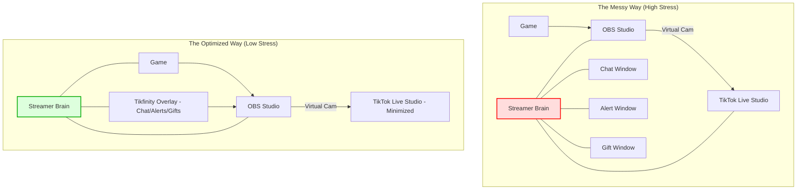

> Source discussion: "Managing TikTok Live while gaming is stressful" — r/gamestreaming. Creators often report high CPU usage, "janky" OBS setups, and the mental fatigue of juggling two platforms at once.

---

## The "Multi-Tasking Meltdown"

You’re mid-clutch in *Warzone* or *Valorant*. Suddenly, your game stutters. You glance at your second monitor: TikTok Live Studio is eating 40% of your CPU, the chat is moving at light speed with "Rose" spam, and your OBS Virtual Camera just froze. 

Instead of focusing on your gameplay and your audience, you’re fighting your software. This isn't just a technical problem; it's **cognitive overload**. When your setup is "janky," your performance drops, your commentary dries up, and the stress becomes visible to your viewers.

## Why TikTok Streaming is Uniquely Demanding

Unlike Twitch or YouTube, TikTok’s streaming ecosystem is still in its "Wild West" phase. This creates three specific stress points:

1.  **The Resource War**: TikTok Live Studio is notoriously unoptimized. It competes with your game and OBS for the same CPU cores and RAM, leading to input lag that "feels" worse than the FPS counter suggests.
2.  **The "Bridge" Fatigue**: Most creators use OBS for its overlays but are forced to use TikTok Live Studio to actually go live. Running two heavy broadcasting apps simultaneously is a recipe for instability.
3.  **High-Frequency Interaction**: TikTok viewers expect rapid-fire responses. The sheer volume of low-value alerts (likes, tiny gifts) can bury important questions and meaningful engagement.

## The Core Insight: Cognitive Load vs. Technical Capability

The mistake most streamers make is trying to solve stress by adding *more* monitors or *more* tools. 

**The reality?** Every new window you have to look at increases your "mental context switching" cost. To stop the stress, you don't need a better PC; you need a **consolidated workflow**. You need to move from a "reactive" setup (fixing things as they break) to an "automated" one.

---

## Step-by-Step: Reducing the Chaos

Here is how to rebuild your setup for maximum gaming performance and minimum mental friction.

### 1. Consolidate Your Visuals (The "One Window" Rule)
Stop looking at OBS *and* TikTok Live Studio. 
- Use **Tikfinity** or **StreamElements** to create a single browser-source overlay that handles *everything*: alerts, goals, and chat.
- Bring that browser source into OBS. 
- Minimize TikTok Live Studio to the system tray. If your Virtual Camera is active, you don't need to see the Studio window.

### 2. Offload the "Heavy Lifting"
If your game is lagging, it’s likely an "Encoder War."
- **OBS**: Use your GPU (NVENC or AMF) for the Virtual Camera output.
- **TikTok Live Studio**: If you have a modern GPU, ensure it’s also using the hardware encoder, but set the quality to "Balanced" rather than "High Quality." The difference in 9:16 mobile viewing is negligible, but the CPU savings are massive.

### 3. Automate Chat Moderation
Don't try to read every "GG" and "Hi."
- Set up **Keyword Filters** in TikTok Live Studio to auto-block spam.
- Use a chatbot to answer repetitive questions (e.g., "!sens," "!rank," "!specs"). This frees your brain to focus on real conversations.

### 4. Use "Borderless Windowed" Mode
While "Fullscreen" offers the best latency, "Borderless Windowed" allows you to move your mouse to your chat monitor without the game minimizing or flickering. This small change reduces the "friction" of interacting with viewers during downtime.

---

## Visualizing the Stress-Free Setup

*In the optimized setup, the streamer only interacts with the Game, OBS, and a single consolidated Overlay. The "background noise" of TikTok Live Studio is hidden, and alerts are merged into a single visual field.*

---

## Verification: The "Flow State" Check

How do you know if your setup is actually better?
1.  **Frame Time Consistency**: Don't just look at FPS. Use a tool like *MSI Afterburner* to check "1% Lows." If your 1% lows improve, the "micro-stutters" that cause stress are gone.
2.  **The "30-Second Rule"**: If you can't go 30 seconds without looking away from your game to fix a technical issue, your setup is still too complex.
3.  **Interaction Ratio**: Are you talking more about the game/life, or more about "Sorry, the stream is lagging"? If it's the latter, drop your bitrate or resolution immediately.

## When to Consider a Dual-PC Setup
If you have followed these steps and your game *still* feels heavy, it might be time to move TikTok Live Studio to a secondary laptop or old PC. TikTok's software is currently a "resource hog," and sometimes the only way to win the war for CPU cycles is to move the battlefield entirely.

By simplifying what you *see* and *do* during a stream, you can return to what actually grows a channel: being an entertaining gamer who actually enjoys the game.
