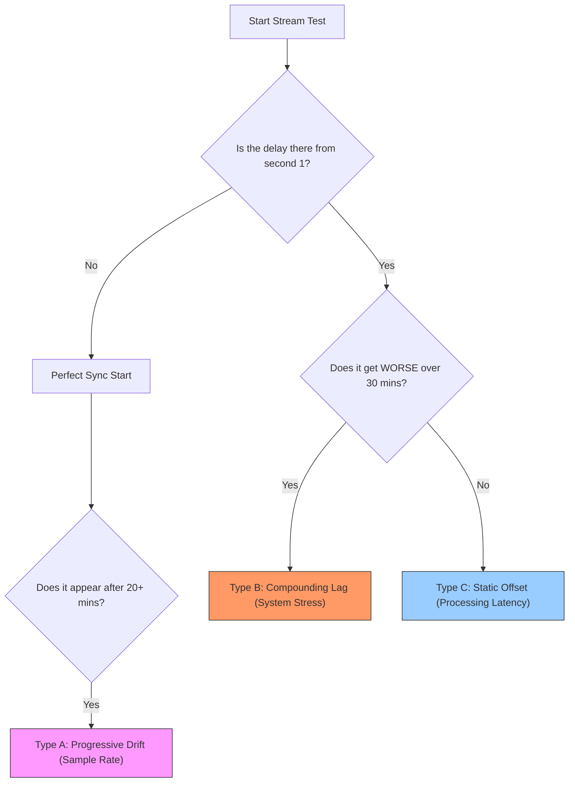

## The "Silent Failure" of Generic Fixes

You’ve probably seen the advice: *"Just add a 200ms delay in OBS!"* 

You try it. It works for 10 minutes, and then your chat starts complaining again. Or worse, you fix the sample rate, but your lips are still moving before the sound hits the stream. 

The problem with most OBS-to-TikTok audio fixes is that they assume everyone has the same problem. In reality, **audio desync on TikTok Live falls into three distinct categories.** If you apply a "static fix" to a "drifting problem," you are just chasing ghosts.

## Step 1: Identify the "Behavior" of the Delay

Before you touch any settings, you must identify how the delay behaves. This is the single most important diagnostic step.

**Diagram Explanation**: This tree helps you stop misattributing the cause.
- **Type A (Drift)** is a clocking issue.
- **Type B (Stress)** is a hardware/bottleneck issue.
- **Type C (Static)** is a routing/software pipeline issue.

---

## Step 2: Match the Cause to the Symptom

### Type A: Progressive Drift (The "Creeping" Delay)
*   **The Cause**: Your OBS is likely set to 48kHz, but your Windows mic settings or your headset is set to 44.1kHz (or vice versa).
*   **The Diagnostic**: If your stream starts perfect but is 2 seconds off by the end of the hour, this is **Sample Rate Mismatch**.
*   **The Real Fix**: Ensure **Windows Sound Control Panel**, **OBS Settings**, and **TikTok Live Studio** are ALL set to exactly 48kHz.

### Type B: Compounding Lag (The "Stuttering" Delay)
*   **The Cause**: Your CPU or GPU is hitting 90%+ usage. When your PC "drops" a frame, the video might catch up, but the audio buffer stays behind.
*   **The Diagnostic**: Does the audio desync happen specifically during intense gameplay or high-motion scenes? 
*   **The Real Fix**: Lower your OBS encoding preset or cap your in-game FPS.

### Type C: Static Offset (The "Always Off" Delay)
*   **The Cause**: The OBS Virtual Camera adds processing time that your microphone (connected directly to TikTok) doesn't have.
*   **The Diagnostic**: If the delay is exactly the same at minute 1 and minute 60, this is **Pipeline Latency**.
*   **The Real Fix**: You need a **Sync Offset** in OBS Advanced Audio Properties (usually between 150ms and 300ms) or use a Virtual Cable to route everything together.

---

## Step 3: The "Clap Test" Verification

To confirm your fix, don't just "talk." Perform a **Clap Test**:

1.  Record a 30-second clip in TikTok Live Studio (using your OBS feed).
2.  Bring your hands into the frame and clap loudly and sharply.
3.  Play it back frame-by-frame. 
    *   If the *sound* happens before the hands touch: You need a **Positive Sync Offset** in OBS.
    *   If the *hands touch* before the sound: You have a **Drift or System Stress** issue (Negative offsets are rarely the solution).

## Practical Conclusion

Don't waste time on VB-CABLE if your problem is a sample rate mismatch. Don't waste time on sample rates if your CPU is screaming for help. Identify the **Type** of your desync first, and you'll fix it in five minutes instead of five hours.

**Next Action**: Open your Windows Sound Control Panel right now. Check every single playback and recording device. If even one is at 44.1kHz while the rest are at 48kHz, you've found your ghost.
