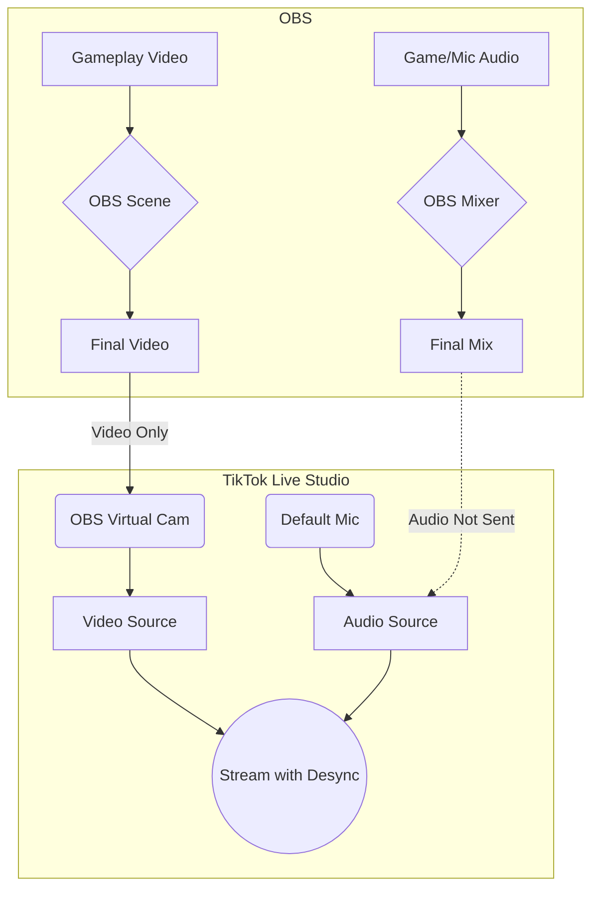

## The Problem: Perfect Sync Everywhere... Except TikTok

You’ve spent hours perfecting your OBS scenes. Your audio is crisp, your video is clean, and on your test recordings and Twitch streams, everything is in perfect sync. But the moment you go live on TikTok using the OBS Virtual Camera, a frustrating audio delay appears. Your mouth moves, and a half-second later, the words come out.

This is a maddeningly common issue for streamers. It makes you feel like you're doing something wrong, even though your setup is flawless on every other platform. As one Redditor put it, "I can’t seem to get audio through my TikTok... I’m not sure if I need to raise the volume output to like 400 instead of 100 from TikTok studio." This captures the feeling of just randomly trying things because the core problem isn't obvious.

## The Real Cause: A "Virtual" Misunderstanding

The root of the problem isn't your OBS settings or your audio interface. It's a fundamental mismatch in how OBS and TikTok Live Studio handle audio and video.

*   **OBS Virtual Camera:** This brilliant feature sends your final OBS video output to other applications. It’s like turning your entire OBS production into a single webcam source.
*   **The Missing Piece:** The Virtual Camera **only sends video**. It does not send audio.

TikTok Live Studio sees the video from your OBS Virtual Camera, but it has no idea about the corresponding audio. So, it grabs audio from what it thinks is the main microphone, leading to a desync.

Here’s a diagram illustrating the disconnect:

This diagram shows how OBS sends its final video to the Virtual Camera, but the audio from the OBS mixer is completely bypassed by TikTok Live Studio, which defaults to a separate mic input. This is the source of the desync.

## The Fix: Creating a "Virtual Audio Cable"

To solve this, you need to create a dedicated audio pathway from OBS to TikTok Live Studio, just like you did for video. The most reliable way to do this is with a virtual audio cable.

### Step-by-Step Checklist

1.  **Install VB-CABLE:** Download and install [VB-CABLE Virtual Audio Device](https://vb-audio.com/Cable/). This creates a virtual "output" (CABLE Input) and "input" (CABLE Output) on your system.
2.  **Set OBS Audio Monitoring:**
    *   In OBS, go to `File` > `Settings` > `Audio`.
    *   Under `Advanced`, set your `Monitoring Device` to `CABLE Input (VB-Audio Virtual Cable)`.
    *   Click `Apply` and `OK`.
3.  **Set Audio Sources to "Monitor & Output":**
    *   Go to your OBS `Audio Mixer`.
    *   For every audio source you want to send to TikTok (your mic, game audio, alerts), click the three dots and go to `Advanced Audio Properties`.
    *   Change the `Audio Monitoring` for each source from `Monitor Off` to `Monitor and Output`.
4.  **Configure TikTok Live Studio:**
    *   Open TikTok Live Studio.
    *   Add your OBS Virtual Camera as a video source.
    *   For your audio source, select `CABLE Output (VB-Audio Virtual Cable)`. **Do not** select your microphone directly.
5.  **Test and Go Live:** Your audio from OBS is now being routed through the virtual cable directly to TikTok Live Studio, perfectly in sync with your video.

## FAQ

**Q: Why do I hear an echo in my headphones now?**

A: This happens because you're hearing both the direct monitor from your audio interface and the monitored audio from OBS. In your system's sound settings, make sure your headphones are your default playback device, not the virtual cable.

**Q: Can I just use TikTok Live Studio without OBS?**

A: You can, but you'll lose all the power and flexibility of OBS—custom scenes, transitions, alerts, and detailed audio control. This fix gives you the best of both worlds.

**Q: Is there a way to do this without third-party software?**

A: Unfortunately, no. The lack of a direct audio channel from the OBS Virtual Camera is a limitation that requires a workaround like VB-CABLE.

## Conclusion: Stop Fighting, Start Streaming

The OBS-to-TikTok audio desync is a technical hurdle, not a sign that your setup is wrong. By understanding that the Virtual Camera is video-only and creating a dedicated audio path with a virtual cable, you can finally achieve the same professional, perfectly synced stream on TikTok that you have on other platforms. No more "janky" workarounds or frustrating trial and error.
