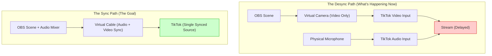

## The Frustration: Perfect Sync Everywhere... Except TikTok

You finish a test recording in OBS—it's flawless. You stream to Twitch or YouTube—zero issues. But the moment you open TikTok Live Studio and pull in your OBS scene, the audio starts lagging. Your mouth moves, but the sound arrives a half-second later.

This "silent failure" of sync is maddening because it feels like a TikTok bug. As one creator on r/OBS put it: *"I’m not sure if I need to raise the volume output... or if my PC just can't handle it."* 

Actually, your PC is fine. The issue is a **fundamental path mismatch** between how OBS sends video and how TikTok expects audio.

## The Diagnostic: Why the Desync Happens

When you use the "OBS Virtual Camera," you are only sending **video data**. OBS doesn't have a "Virtual Audio Cable" built into the camera feature. Because TikTok Live Studio isn't receiving audio from that same "camera" source, it tries to grab your microphone separately. 

This creates two different paths with two different processing times.

**What this diagram shows**: The current problem is that your video goes through the OBS processing engine (Virtual Cam), while your audio bypasses it and goes straight to TikTok. This mismatch in processing time (latency) is what causes the desync. To fix it, we need to force the audio through the same "processing pipe" as the video.

## The Fix: The "Virtual Cable" Workflow

To bridge the gap, you need a way to send your *monitored* audio from OBS directly into TikTok as a single input.

### Step-by-Step Checklist

1.  **Install a Virtual Cable**: Download and install [VB-CABLE](https://vb-audio.com/Cable/). It’s a free tool that acts like an invisible audio cord inside your PC.
2.  **Set OBS Monitoring**:
    *   In OBS, go to **Settings > Audio**.
    *   Under **Advanced**, set **Monitoring Device** to `CABLE Input (VB-Audio Virtual Cable)`.
3.  **Route Your Audio Mixer**:
    *   Right-click anywhere in your OBS **Audio Mixer** and select **Advanced Audio Properties**.
    *   For your Mic and Desktop Audio, change the **Audio Monitoring** column to `Monitor and Output`.
4.  **Configure TikTok Live Studio**:
    *   In TikTok Live Studio, go to **Audio Settings**.
    *   Set your **Microphone/Input** to `CABLE Output (VB-Audio Virtual Cable)`.
    *   **Crucial**: Disable any other mic inputs in TikTok to avoid echoes.

## FAQ: Common "Post-Fix" Issues

**"I can't hear my own game anymore!"**
Check your OBS monitoring settings. Make sure you haven't set your *Windows* default playback to the virtual cable. Your Windows output should still be your headphones; only the OBS *Monitoring Device* should be the cable.

**"There's still a tiny delay..."**
In OBS **Advanced Audio Properties**, you can add a "Sync Offset" (in milliseconds) to your mic. If the audio is ahead of the video, add a positive offset (e.g., 200ms).

## Practical Conclusion

TikTok Live Studio wasn't designed to be a "pro" mixer—it's designed for ease of use. By using OBS as your master mixer and VB-CABLE as your bridge, you take the control back. 

**Next Action**: Run a 30-second private test stream on TikTok. Record it, play it back, and check the lip-sync. If it's still off, tweak the **Sync Offset** in OBS by 50ms increments.
