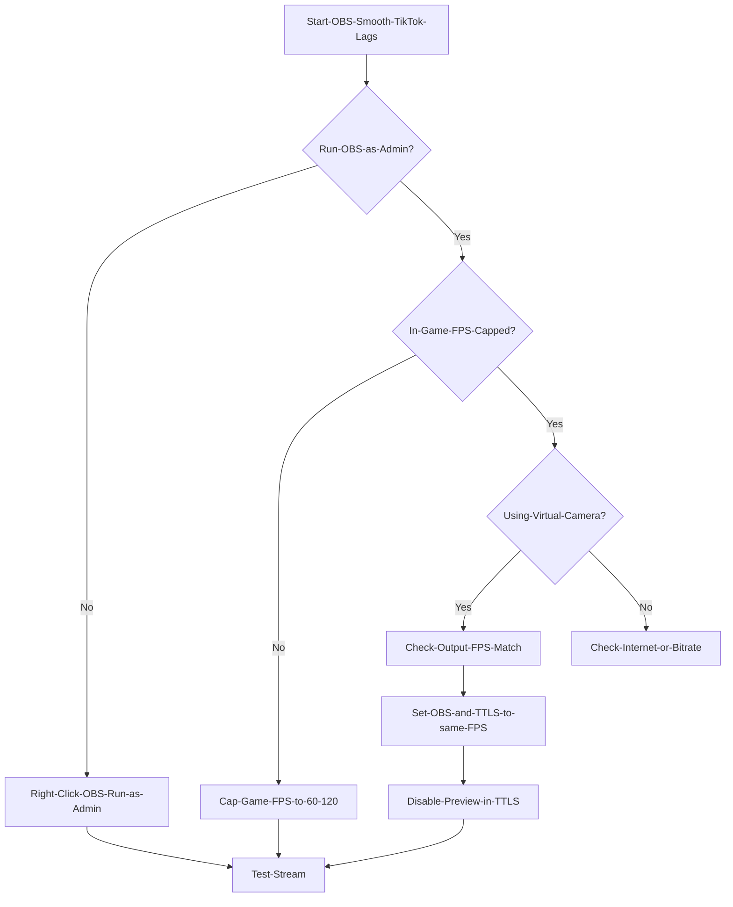

> Source discussion: "Major issues with stream lag while multi streaming" — r/OBS. Streamers constantly report that while their local preview and Twitch streams are fine, the TikTok feed (often via TikTok Live Studio or Virtual Cam) stutters uncontrollably.

---

## TL;DR

If OBS looks fine but TikTok lags, your GPU is likely maxed out trying to render the game, OBS, *and* TikTok Live Studio simultaneously. **Run OBS as Administrator**, **cap your in-game FPS**, and ensure your canvas frame rates match (e.g., both 60fps) to stop the stutter.

## Introduction

It’s the most frustrating feeling in streaming. You look at your second monitor: OBS shows a crisp, smooth 60fps stream. You look at your game: buttery smooth.

Then you look at your phone or chat.
*"Lag." "Slideshow." "Bro is playing on a toaster."*

The confusion is real. *"How can it lag if my OBS says 0 dropped frames?"*

The issue isn't usually your internet. It's a silent battle for resources happening inside your PC. When you stream to TikTok—especially if you're using **TikTok Live Studio (TTLS)** to capture **OBS Virtual Camera**—you are essentially running two broadcasting softwares at once. This guide breaks down exactly why this happens and how to fix the "smooth preview, laggy stream" paradox in 2025.

## The "Invisible" Bottleneck

Most creators assume lag = bad internet. But in this specific case, it's usually **Rendering Lag** or **Encoding Overload**.

When your GPU is at 99% usage (because you're playing a modern game with uncapped FPS), Windows deprioritizes background apps. If OBS is fighting for scraps of GPU power, it might handle the preview fine but fail to send a consistent frame timing to TikTok Live Studio or the Virtual Camera.

## Actionable Steps to Fix the Lag

Follow this diagnostic path to identify and kill the lag source.

### 1. The "Run as Administrator" Magic
This is the #1 fix for 90% of OBS lag issues.
*   **Why:** Windows has a "Game Mode" that gives all GPU power to your active game. OBS gets starved.
*   **Fix:** Close OBS. Right-click the shortcut. Select **"Run as Administrator"**.
*   **Result:** Windows now treats OBS as a high-priority process, reserving GPU juice for it even if your game wants 100%.

### 2. Cap Your In-Game FPS
If your GPU is running at 99-100% load rendering 143 FPS in *Call of Duty*, there is zero headroom left for OBS to compose the scene or for TikTok Live Studio to encode it.
*   **The Fix:** Go to your game settings. Cap the FPS to a multiple of your stream (e.g., 60, 120, or 144).
*   **Goal:** Keep GPU usage around 90-95% max to leave breathing room for streaming tools.

### 3. Match Your Frame Rates
A common mistake is running OBS at 60fps but having TikTok Live Studio set to 30fps (or vice versa), or having mismatched Virtual Camera settings.
*   **Check:** Ensure OBS Video settings (`Settings > Video > FPS`) match the input settings in TikTok Live Studio.
*   **Why:** Mismatched frame timings cause "judder" or perceived lag, even if no frames are technically dropped.

### 4. Disable the "Double Preview"
If you are using the OBS Virtual Camera into TikTok Live Studio:
1.  Open TikTok Live Studio.
2.  Add the camera source.
3.  **Hide or minimize the preview** inside TikTok Live Studio if possible, or at least don't have the preview running at "Source Quality" on your second monitor. Rendering the preview twice (once in OBS, once in TTLS) eats unnecessary resources.

## FAQ

**Q: Why does my Twitch stream work fine but TikTok lags?**
A: Twitch usually streams directly from OBS via RTMP. TikTok often involves running a *second* app (TikTok Live Studio) or using a Virtual Camera, which doubles the encoding/rendering workload.

**Q: Should I use x264 or NVENC?**
A: If your GPU is the bottleneck (causing the lag), try switching one of the programs (like the recording side) to x264 to shift load to your CPU, provided you have a strong processor (Ryzen 9 / i9).

**Q: Is there a plugin to avoid TikTok Live Studio entirely?**
A: Yes! The **Aitum Vertical Plugin** allows you to stream vertically directly from OBS if you have a stream key. If you don't have a key, you're stuck with the Virtual Camera method or "screencasting" method, which requires the optimization steps above.

## Conclusion

You don't need a dual-PC setup to stream smoothly to TikTok. You just need to respect your GPU's limits. By running as Admin and capping your game's FPS, you ensure that OBS and TikTok Live Studio get the resources they need to keep that feed buttery smooth. Stop the slideshow and get back to the clips!
