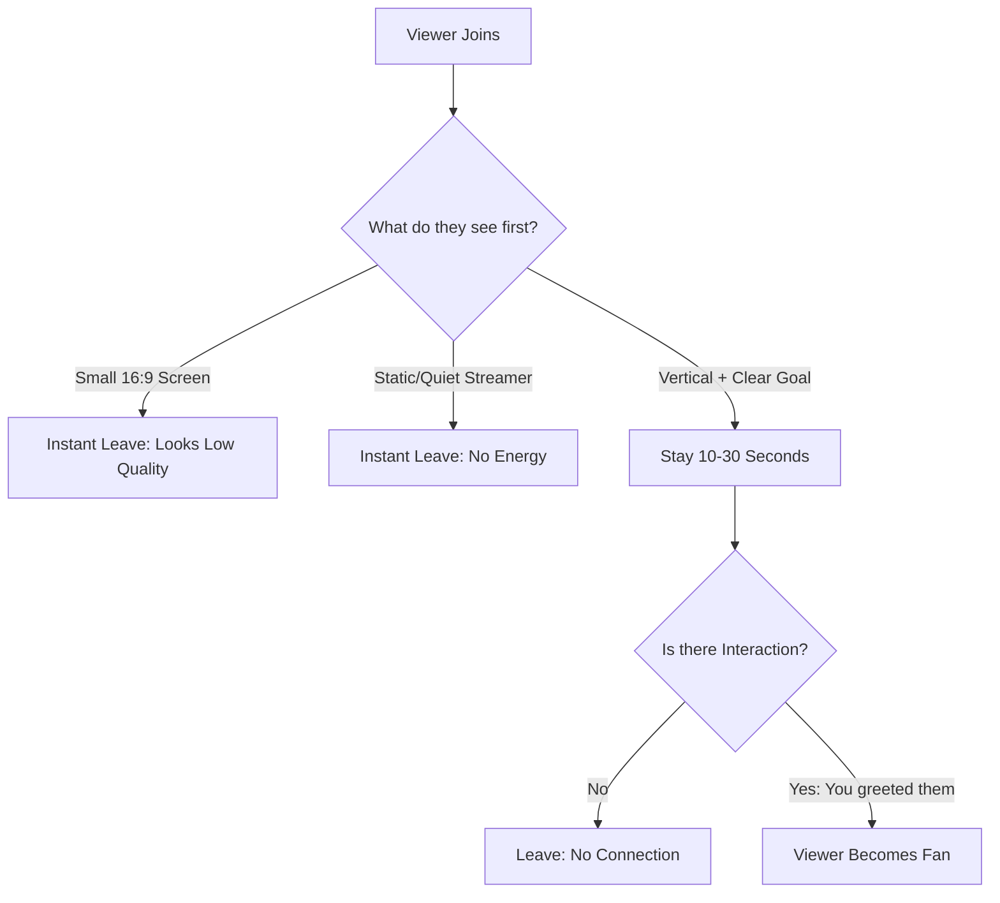

## The "Drive-By" Viewer Problem

It is a common frustration for gaming streamers on TikTok: you see the notification "User joined," and before you can even say "Hello," they are gone. On Twitch, a viewer joining is a commitment. On TikTok, it is a drive-by.

The reason people join then instantly leave isn't necessarily your gameplay; it is your **entry-point friction**. You are fighting the "Scroll Habit," and if you don't break that habit in under 3 seconds, you lose the viewer forever.

---

## Root Cause: The "Boring Screen" Trap

When a user scrolls onto your Live, they aren't looking at your game—they are looking for a reason to stop scrolling. 

Most gaming streams fail because they look like a tiny 16:9 rectangle with black bars at the top and bottom. To a scroller, this looks like a technical error or a low-effort stream. If the first thing they see is a quiet person playing a game they don't understand, they have no reason to stay.

---

## Core Insight: The "Visual Hook" Priority

Success on TikTok Live is about **Visual Context**. A viewer should know exactly what is happening in your stream without hearing a single word.

### One Paragraph Insight
Your stream must pass the "Mute Test." If a viewer joins on mute, can they tell what your goal is? If you are doing a challenge (e.g., "10 Kills = End Stream"), that text needs to be massive and readable. If they have to wait for you to speak to understand the stream, they will have already scrolled past you.

---

## Step-by-Step Solution: The 3-Second Retention Fix

Use these three pillars to "glue" viewers to your stream the moment they land on it.

### 1. The "Vertical Tax" Layout
Stop using 16:9. Use the OBS Vertical Plugin to create a layout that fills the screen.
*   **Top 25%**: Your Facecam (Close-up, high lighting).
*   **Middle 50%**: Action-packed gameplay (Zoomed in on the crosshair or main character).
*   **Bottom 25%**: A clear, high-contrast **Live Goal** or **Question** (e.g., "What game should I play next?").

### 2. The "Non-Stop Yap" Strategy
In TikTok Live, "Dead Air" is the silent killer. You cannot wait for the chat to talk to you.
*   **Narrate everything**: "I'm going to push this corner, watch the left, oh he's there, nice!"
*   **The "Welcome Loop"**: Every 2 minutes, reset the room. "Welcome in everyone, we're currently trying to get 5 wins in a row, currently at 3!"

### 3. High-Contrast Overlays
TikTok's UI (the chat, the buttons) covers the bottom and right side of your screen. 
*   Move your important info (Kill counter, Sub goal) to the **top-left** or **center-top**.
*   Use bright colors (Neon Green, Pink, Orange) for your text to make it pop against the game background.

---

## Decision Flow: Why Are They Leaving?

### What this diagram shows
This flowchart highlights that the "Visuals" get them to stay for 10 seconds, but your "Energy" gets them to stay for 10 minutes. You need both to build a community.

---

## Verification & Practical Checks

### Check Your "Average Watch Time"
In your TikTok Creator Center, look at your Live Analytics.
*   **< 5 Seconds**: Your visual layout is the problem.
*   **5-15 Seconds**: Your "Hook" or "Intro" is the problem.
*   **> 30 Seconds**: You have successfully captured them; now focus on "Conversion."

### The "Screenshot Test"
Take a screenshot of your stream on your phone. If you can't read your "Goal" text or see your face clearly in that tiny thumbnail, neither can the viewers scrolling the FYP.

**Final Tip**: Don't greet every person who joins by name unless they type in chat. On TikTok, being "called out" while just lurking can actually make people leave out of social anxiety. Greet the "Room" instead of the "Individual."
