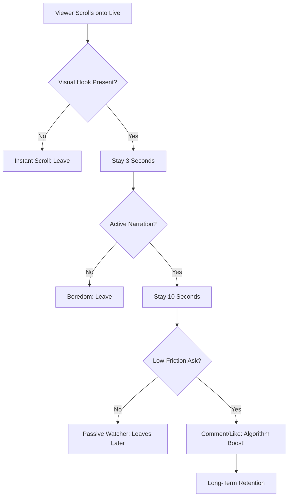

## The "Revolving Door" Syndrome

You check your TikTok Live analytics after a stream. You see 500+ "Total Viewers," but your "Average Concurrent Viewers" was only 3. You feel like you’re running a revolving door—people walk in, take one look, and walk right back out.

This is the most common frustration for new TikTok creators. On Twitch, people choose to click your thumbnail. On TikTok, people are **forced** to see you as they scroll. If you don't give them a reason to stop their thumb in under 3 seconds, they are gone forever.

---

## Root Cause: The Context Gap

The primary reason viewers leave isn't that your content is "bad"—it's that they have **zero context.**

When a viewer scrolls onto your Live, they are jumping into the middle of a movie they haven't seen. If you are sitting there silently reading chat, or focused on a game without explaining what’s happening, the viewer feels like an outsider. Humans hate feeling confused, so they scroll to something simpler.

---

## Core Insight: "Context per Second"

To keep a viewer, you must maximize the amount of information they receive in the first few seconds without them having to ask.

### One Paragraph Insight
Retention on TikTok is a race against the scroll. You aren't competing with other streamers; you are competing with the dopamine hit of the *next* video. If a viewer has to wait more than 5 seconds to understand what you are doing, why you are doing it, and why they should care, you have already lost. Your stream must be "self-explanatory" at all times.

---

## The 3-Layer Retention Strategy

### 1. The Visual Hook (Layer 1: 0-2 Seconds)
Use a **Static Text Overlay** at the top of your screen. 
*   **Wrong:** "Gaming Stream"
*   **Right:** "Can we hit 50 wins today?" or "Ask me anything about [Topic]"
*   This gives the viewer immediate context before you even open your mouth.

### 2. The Audio Hook (Layer 2: 2-5 Seconds)
Avoid "Dead Air." Use **Active Narration.**
*   Instead of waiting for a comment to speak, narrate your internal monologue. 
*   "I'm trying to figure out this puzzle because..." or "Just welcomed 5 new people, we're currently discussing..."
*   This makes the viewer feel like they walked into a conversation, not a silent room.

### 3. The Interactive Hook (Layer 3: 5+ Seconds)
Lower the "Friction to Chat."
*   New viewers are afraid to be the first to speak. Give them a low-stakes way to interact.
*   "Drop a '1' in the chat if you've ever had this happen to you."
*   "Where is everyone watching from today?"
*   These "micro-interactions" convert a passive scroller into an active participant.

---

## The Retention Flow Logic

### What this diagram shows
This flowchart visualizes the "Retention Chain." If you miss the Visual Hook, you never even get the chance to speak. If you miss the Active Narration, the viewer never reaches the point of interacting.

---

## Verification: The "Mute Test"

### How to Check if Your Stream Works
Record a 30-second clip of your stream. Watch it back with the **sound turned off.**
*   Can you tell exactly what the stream is about in 3 seconds?
*   Is there a clear goal or topic visible?
*   If you just see a person sitting in a chair, your stream is failing the Mute Test. You need more visual context (overlays, props, or more dynamic movement).

### Edge Case: High-Energy Burnout
Don't confuse "retention" with "screaming." You don't need to be high-energy 24/7. You just need to be **clear.** A calm, focused stream with a clear goal (e.g., "Painting this mini for 2 hours") will retain viewers better than a loud stream with no direction.

### When the Solution Does NOT Apply
If you are running a "Sleep Stream" or a "Silent ASMR" stream, the rules are different. In those cases, the *lack* of interaction is the hook. However, for 99% of creators, the "3-Layer Hook" is the standard for growth.
