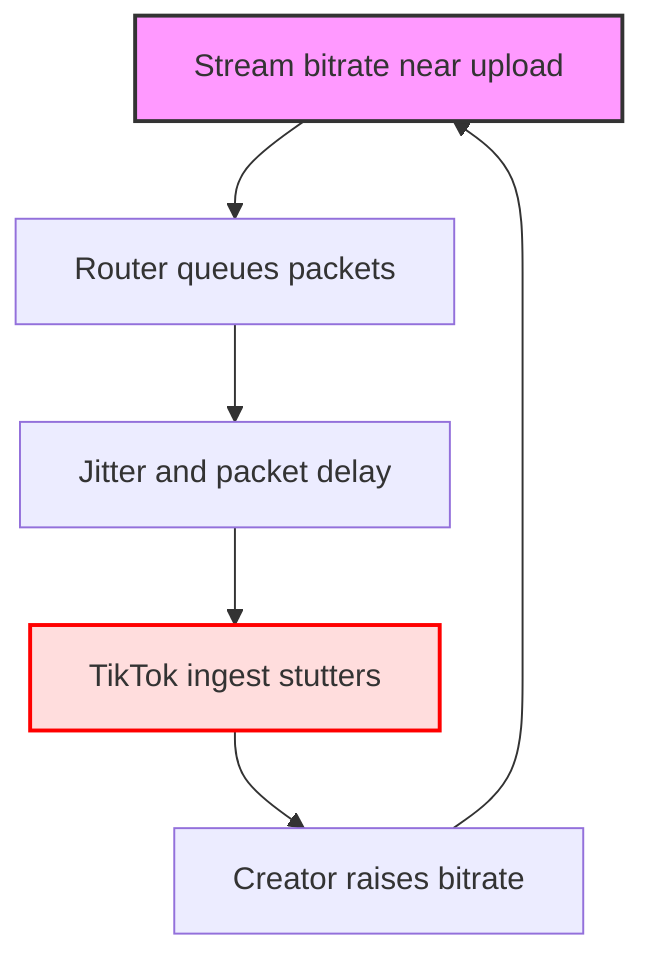

<TOCInline toc={props.toc} exclude="Introduction" />

## TL;DR

If your OBS preview is smooth but TikTok Live drops frames, the issue is usually **upload jitter**, not your GPU. Fix it by giving your stream headroom (bitrate ≤ 60% of real upload), switching to wired Ethernet, and (if your home network is “fast but spiky”) enabling router QoS/SQM to stop bufferbloat.

## Introduction

This is the classic TikTok Live rage moment:

*"OBS looks perfect. My game looks perfect. But TikTok is dropping frames."*

You are not crazy. OBS preview is your local render. TikTok Live is what happens after your video is encoded, sent, ingested, re-processed, and played back on phones.

This guide focuses on the most common cause of “smooth preview + dropped frames”: **your upload path is unstable under load**.

## What “Dropped Frames” Usually Means Here

When creators say “dropped frames,” they usually mean one of these:

- OBS shows `Dropped Frames (Network)` increasing in `View → Stats`
- TikTok Live Studio shows a dropped frames warning while OBS looks fine
- Viewers say the stream stutters, but OBS preview and Stats look normal

All three can be caused by the same thing: your connection can’t keep a steady stream of packets flowing to TikTok. It’s not always “slow internet.” It’s often **jitter** (timing inconsistency) caused by Wi‑Fi, saturation, or bufferbloat.

## The Hidden Trap: Bufferbloat Makes “Fast Internet” Drop Frames

If your upload is near maxed out, your router/ISP queues packets. Video packets arrive late, TikTok’s ingest can’t keep a steady decode cadence, and you see stutter or drops.

**Diagram Explanation**: This is the “fast but unstable” loop. When you raise bitrate to fix quality, you can actually increase jitter and make drops worse. The first fix is headroom, not more bitrate.

## Mistake 1: Trusting a Speed Test Instead of a Sustained Upload

Speed tests are short. Streaming is sustained. You can “hit” 20 Mbps upload for 5 seconds and still drop frames during a 2-hour Live.

**Correction**
- Go live and open `View → Stats` in OBS.
- Watch `Dropped Frames (Network)` for a full 5–10 minutes.
- Test on a phone feed (LTE is best) so you’re not fooled by local preview.

## Mistake 2: Setting Bitrate Too Close to Your Real Upload

This is the most common reason you drop frames “randomly.” One small upload spike (Windows update, cloud sync, someone on Wi‑Fi) is enough to break the stream.

**Correction**
- Set stream bitrate to **≤ 60%** of your real sustained upload.
- Use `CBR` while troubleshooting.
- Set keyframes to `2` (this reduces weird ingest behavior during congestion).

## Mistake 3: Streaming on Wi‑Fi (Even “Good” Wi‑Fi)

Wi‑Fi is bursty. That burstiness is exactly what TikTok ingest punishes.

**Correction**
- Use wired Ethernet for one test session.
- If you can’t, move closer to the router and force 5 GHz (avoid 2.4 GHz).

## Mistake 4: Ignoring Bufferbloat (Your Router Is the Problem)

Bufferbloat is when your router lets uploads queue too deeply. Your stream becomes “late,” not “slow.”

**Correction**
- Enable QoS/SQM if your router supports it (sometimes called Smart Queue Management).
- Set upload shaping to ~**85–90%** of your plan’s upload so the router controls the queue (not your ISP).

## Mistake 5: Letting Background Uploads Compete with Your Stream

Backups, sync tools, Discord, browser tabs, and game launchers can quietly eat upload.

**Correction**
- Pause cloud sync (OneDrive/Google Drive).
- Stop game downloads/updates.
- Close any app that uploads video (Discord streaming, browser-based calls).

## Mistake 6: Assuming “TikTok Ingest” Is Always the Same

TikTok can route you to different ingest paths. Sometimes one path is just worse for your ISP route that day.

**Correction**
- Restart the stream and re-test (you may land on a different route).
- If you use an RTMP URL with region choices, pick the closest region.
- If you have persistent issues, try forcing IPv4 in OBS (`Settings → Advanced → Network → IP Family`).

## Step-by-Step: The 10-Minute Stability Baseline

Do this once, and you’ll know if your problem is stability vs settings.

1. Set `720x1280 @ 30 FPS`
2. Set `CBR`, `2500–3500 Kbps`, keyframes `2`
3. Go live for 10 minutes
4. Watch OBS Stats for `Dropped Frames (Network)`
5. Watch on a phone feed for stutter

If this baseline is stable, you can scale quality. If it is not, fix stability first (Ethernet + headroom + QoS/SQM).

## Actionable Checklist

- [ ] Start at `720x1280 @ 30 FPS` until stable
- [ ] Set keyframes to `2` and use `CBR` while troubleshooting
- [ ] Keep bitrate ≤ 60% of your real sustained upload
- [ ] Use wired Ethernet for at least one test
- [ ] Enable router QoS/SQM and shape upload to 85–90%
- [ ] Pause all background uploads during streams
- [ ] Watch `View → Stats` during a real stream, not just preview

## FAQ

### “Is it normal that OBS looks smooth but TikTok drops frames?”

It’s common. It usually means your stream can’t maintain steady packet timing to TikTok (jitter/bufferbloat). OBS preview can stay perfect because preview is local.

### “Why do I drop frames even with high upload speed?”

Because speed is not stability. A stable 6 Mbps upload beats a spiky 30 Mbps upload for live video.

### “Should I stream 60 FPS to TikTok?”

Only after you prove stability at 30 FPS. TikTok Live is far less forgiving than Twitch about frame pacing and bitrate stability, especially for vertical streams.

## Practical Conclusion

When TikTok Live drops frames but OBS preview is smooth, start with the boring fixes that actually work: headroom, Ethernet, and bufferbloat control. Once your upload is stable at 720p30, you can scale quality without gambling your stream on a “fast but spiky” connection.
