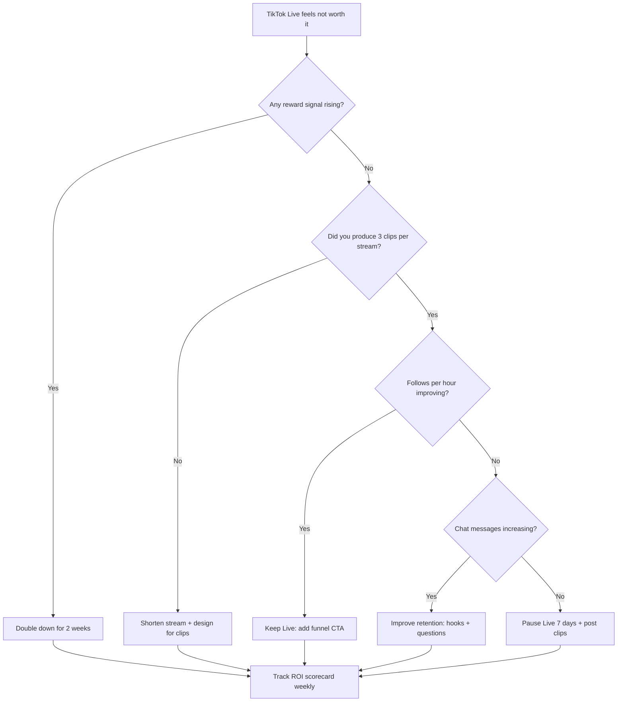

## TL;DR

TikTok Live can feel like bad ROI because the “reward” is rarely immediate money. Track 5 simple signals (cash, follows, chats, clips, and returners) for 2 weeks, then use the decision tree in this post to decide whether to change your format, shorten sessions, or move to a funnel strategy.

## Introduction: Why It Feels Pointless

If you’ve ever had the experience of “some days TikTok gives me 10+ viewers, other days it’s dead,” you’re not imagining it. TikTok Live is volatile by design. The platform tests your stream with small batches of viewers, then either expands distribution or cuts it off.

That volatility creates the exact emotional problem small streamers describe in r/smallstreamers: you can’t tell if the effort is paying off, because the feedback is inconsistent and delayed.

This post is a decision guide for one question:

When is TikTok Live actually worth the effort for a small streamer?

## Step 1: Define “Reward” Before You Quit

Most creators only count one kind of reward:

- Money (gifts, subs, sponsorships)

That’s valid, but it’s incomplete. TikTok Live can pay you in five different ways:

1. Cash: gifts, subscriptions, incentives (when available)
2. Audience: follows and profile clicks
3. Community: people who return and talk
4. Content inventory: clips you can post later
5. Skill: you get better at holding attention

If you only track cash, TikTok Live will feel like a scam until you’re already large.

## Step 2: Understand the “Effort Tax” You’re Paying

TikTok Live often costs more effort than Twitch for small streamers because you’re paying at least one of these taxes:

- The vertical tax: your best setup has to be redesigned for 9:16
- The performance tax: quiet “chill streaming” does not survive the scroll
- The context tax: viewers join mid-stream and leave if they don’t understand you in 3 seconds
- The tooling tax: Live Studio bugs, duplicated apps, extra CPU/GPU load

If you don’t reduce those taxes, effort grows while reward stays flat.

## Step 3: Use a 5-Signal ROI Scorecard (No Spreadsheet Needed)

For your next 6 streams, write down these numbers right after you end:

1. Cash: gifts/subs earned
2. Follows: new followers from Live
3. Chats: total chat messages (or your best estimate)
4. Clips: number of “postable” moments you captured (aim for 3)
5. Returners: how many names you saw again this week

Then ask one simple question:

Did any of these rewards improve week-over-week?

If the answer is “no,” you don’t need more grind. You need a format change.

## Decision Guide: Double Down, Pivot, or Pause

This diagram shows a practical decision path: if nothing is improving, don’t “try harder.” Change the inputs (format, length, and post-stream packaging) until at least one reward signal starts rising.

## The 3 Most Common “Effort Without Reward” Mistakes

### Mistake 1: Streaming with no promise

If your stream title and first 3 seconds don’t communicate a promise, viewers leave.

Fix:

- Put a visible promise on screen: “Road to Diamond (0/5 wins)” or “Coaching 3 ranked games”

### Mistake 2: Treating Live like the final product

For small streamers, Live is often the raw material. The product is the next-day clip.

Fix:

- End every stream by marking 3 moments you can post
- Post within 24 hours while the context is fresh in your voice

### Mistake 3: Doing long sessions with low signal

A 4-hour stream with no clips and no returners is not dedication. It’s wasted effort.

Fix:

- Run 60–90 minute “ROI sprints”
- Evaluate weekly, not emotionally, right after a bad stream

## A Practical 60-Minute ROI Sprint (Checklist)

1. Put one promise on screen (goal, challenge, or question)
2. Start with narration immediately (no waiting for chat)
3. Ask a low-friction question every 3 minutes
4. Create 3 clip moments on purpose (reaction, fail, lesson)
5. End with one clear CTA: follow for the next attempt, or join your main platform

If you can’t do all five, shorten the session until you can.

## FAQ

### Is TikTok Live worth it if I’m not getting gifts?

It can be, if you’re consistently getting follows, chat, returners, or clips you can post. If you’re getting none of those, it’s not worth continuing in the same format.

### How long should I try before deciding it’s not working?

Two weeks is enough if you’re tracking the five signals and testing one format change per week. “Trying” without measuring just extends the frustration.

### Should I multistream to Twitch while I do TikTok Live?

If your PC can handle it, multistreaming reduces the emotional risk because you’re building two surfaces at once. If multistreaming makes your stream unstable, keep TikTok as a short ROI sprint and put your long-form community time on Twitch.

### What if TikTok Live gives me random spikes then nothing?

That’s normal. Treat spikes as a test. When you get one, save it as a format template: what was the promise, what were you doing, how did you talk, and what made people type?

## Conclusion

TikTok Live effort feels “not worth it” when you measure reward as money-only and when you stream long hours without a repeatable format. Define reward across five signals, run short ROI sprints, and make a decision based on weekly trend—not one stream.

