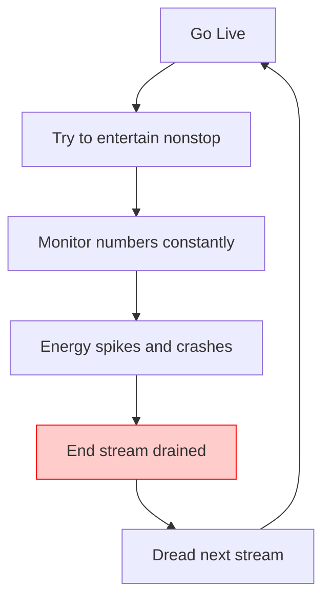

## TL;DR

TikTok Live feels exhausting when you treat it like a constant-performance test. Fix it by designing your stream around energy budgets: shorter “event” sessions, a repeatable talk structure, and hard boundaries that stop the algorithm from living in your head.

## Introduction

“TikTok Live feels exhausting” is one of those phrases that sounds vague until you’ve lived it.

You’re not necessarily sad. You might even be getting views. You’re just drained in a very specific way: social battery empty, brain buzzing after stream, and the “I should go live again” guilt sitting on your shoulder.

On r/smallstreamers, the threads around this pain point usually show three distinct perspectives:

- **Perspective 1 (mental health first):** “Take a break. This isn’t worth your sanity.”
- **Perspective 2 (strategy fix):** “You’re streaming too long with no structure. Shorter, higher-intent sessions are easier and work better.”
- **Perspective 3 (hard disagreement):** “This is just what it takes. Push through. Consistency is key.”

The useful angle for searchers is not “motivation.” It’s **design**: how do you stream TikTok Live in a way your body can tolerate?

This post is an experience recap of what changed for me when I stopped treating TikTok Live like a 3-hour endurance test and started treating it like a system.

## The Real Problem I Was Solving (Not “Burnout”)

I thought I was burned out on streaming.

What I was actually burned out on was:

- **being “on” with no script**
- **talking into silence and blaming myself**
- **watching viewer count swings like a heartbeat monitor**
- **feeling guilty on off-days**

That’s not just tiredness. That’s an energy leak loop.

### What this diagram shows

This loop is why “just take a day off” doesn’t always fix it. If you return to the same structureless stream, the same energy leak happens again.

## The Sustainable Switch: What I Changed (Lessons Learned)

### Lesson 1: I stopped trying to stream “forever”

Long sessions feel productive, but on TikTok they often create a trap: you spend hours waiting for waves, then you’re too tired to be sharp when they arrive.

What worked better:

- **60–90 minutes**, high-intent
- stop while I still had energy
- end with a clear “next” (clip, note, plan)

The goal wasn’t to “grind.” The goal was to finish the stream and still feel like a person.

### Lesson 2: I used a talk structure so my brain could rest

When you wing it, your brain is doing live improv the entire time.

I started using a simple loop:

- **Hook:** what are we doing right now?
- **Context:** why does it matter?
- **Narrate:** what am I thinking?
- **Prompt:** one easy question for chat

This reduces the “blank air panic,” which is one of the biggest exhaustion drivers.

### Lesson 3: I separated “discovery mode” from “community mode”

This was the biggest mindset shift.

I stopped expecting the same stream to do two jobs at once.

- **Discovery mode (first 15 minutes):** clear on-screen promise, fast recap, high narration.
- **Community mode (middle):** slower pace, deeper conversation, real connection.

If I stayed in discovery mode for 2 hours, I’d burn out. If I started in community mode, I’d get no traction and feel defeated.

### Lesson 4: I cut the biggest hidden energy leak: “numbers checking”

The disagreement in r/smallstreamers threads is real: some people say you must stare at analytics to improve.

My experience: checking numbers live didn’t make me better. It made me anxious.

So I moved analytics to one place:

- review after stream
- write down 1 fix for next time
- stop thinking about it

### Lesson 5: I defined a “minimum viable stream”

When I felt exhausted, I used to either:

- force a full stream (and resent it), or
- skip entirely (and feel guilty)

Now I have a third option: **minimum viable stream**.

- 30–45 minutes
- one simple format
- one repeatable prompt
- end before it becomes a slog

It keeps consistency without sacrificing recovery.

## The “Energy-Safe” TikTok Live System (Step-by-Step)

1. **Pick one stream job:** discovery or community.
2. **Set a hard cap:** 60–90 minutes (or minimum viable stream at 30–45).
3. **Use the talk loop:** hook → context → narrate → prompt.
4. **Design one low-effort interaction trigger:** “Type 1 or 2” beats “how are you?”
5. **End with a landing:** clip note, next stream plan, one sentence summary.

## Actionable Checklist (Use This Tonight)

- Stream length cap written down (not “until I’m tired”)
- One on-screen promise (goal, challenge, topic)
- One talk loop taped to your monitor
- One binary prompt ready (“1 or 2” / “yes or no”)
- Viewer count hidden or de-emphasized
- Post-stream: write 1 fix, then stop thinking about it

## FAQ

### Why does TikTok Live feel more exhausting than Twitch?
Because TikTok is a faster feedback loop. Viewer waves, rapid churn, gifts, and constant micro-decisions make your brain work harder even if the stream “looks easy.”

### Is it normal to feel drained even if the stream went well?
Yes. A “good” TikTok Live can still be overstimulating. The fix is not to quit. It’s to reduce the energy leak: shorten streams, add structure, and recover on purpose.

### Should I take a break from TikTok Live?
If you’re dreading “Go Live” every day, take a short break. But don’t come back to the same stream design. Change the system first, or you’ll recreate the same exhaustion.

### How often should a small streamer go live on TikTok?
As often as you can stay genuinely present. For most small streamers, **3–5 high-quality sessions** beats 7 drained sessions.

## Practical Conclusion

TikTok Live doesn’t have to feel like a job you hate.

If it’s exhausting, assume you have an energy leak in your stream design, not a character flaw. Shorten the session, add structure, separate discovery from community, and stop letting live numbers control your nervous system.

That’s how you keep going long enough to actually win.

