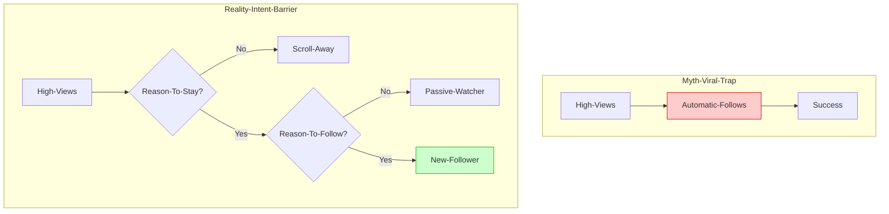

## The "Silent Failure" Cycle

You see the numbers climbing. 500 viewers... 800 viewers... 1,200 viewers. You’re performing your heart out. Then you check the summary: **+4 New Followers.**

The immediate reaction is to blame the algorithm or assume you're "shadowbanned" for followers. On r/TikTokCreators, this is the most common source of burnout. But before you delete your account, you need to see where your effort is actually going.

Most creators are fighting ghosts because they believe in conversion myths that don't exist on TikTok.

## The Myth vs. Reality Map

**Diagram Explanation**: This diagram shows the "Error Attribution" common among creators. High views do NOT equal follows. Views are provided by the algorithm; follows are earned by the creator through specific "Intent Triggers."

---

## Myth 1: "If my content is good, they will follow."
**The Correction**: In TikTok Live, "good" is the baseline for *staying*, not *following*. 
A viewer might watch you for 10 minutes because you’re funny, but if they don't know *when* you'll be live again or *why* they need to see you again, they won't hit the button. 
*   **The Fix**: You must provide a "Future Value" proposition. *"Follow to join our community raids every Friday"* is a reason. *"I'm funny"* is just a temporary state.

## Myth 2: "Asking for follows makes me look desperate."
**The Correction**: On TikTok, viewers are in a "Passive Scroll" state. Their brain is on autopilot. They often forget the "Follow" button exists until you point it out.
*   **The Fix**: Use "Soft CTAs" (Call to Actions). Instead of begging, integrate it into the gameplay: *"We're only 5 follows away from unlocking the next challenge!"* This turns following into a game mechanic, not a favor.

## Myth 3: "I need 10k views to get real growth."
**The Correction**: High-view streams often have the *lowest* conversion rates because the audience is too broad. "Viral" viewers are the hardest to convert.
*   **The Fix**: Focus on "Community Density." 50 viewers who are actively chatting will convert at a 5x higher rate than 5,000 viewers who are just passing through.

---

## Common Mistakes & Quick Corrections

| Mistake | Why it Kills Conversion | The 60-Second Correction |
| :--- | :--- | :--- |
| **Silent Gameplay** | No personality to connect with. | Narrate your internal monologue. |
| **No Goal Overlay** | No visual "progress" for the viewer. | Add a simple "Follow Goal" bar. |
| **Ignoring New Joins** | Viewer feels like a ghost. | Set a "Welcome" alert or shoutout. |
| **Empty Bio** | No "vouch" for your content. | Pinned clips showing your best moments. |

## FAQ: Why do my follows "drop" after the stream?
It’s rarely a glitch. TikTok Live viewers are impulsive. They might follow in the heat of a moment but "unfollow" later if your profile doesn't match the vibe they saw live. Ensure your profile (videos and bio) matches your live energy.

## Practical Conclusion
Stop chasing the 1,000-view high. If you can't convert 10 viewers into 1 follower, 10,000 viewers won't help you. Focus on the **Intent Trigger**: Give them a reason to want to see you *tomorrow*, not just *now*.

**Next Action**: Watch your own stream playback for 5 minutes. Count how many times you gave a viewer a specific reason to follow (besides "I'm live"). If the answer is zero, start there.
