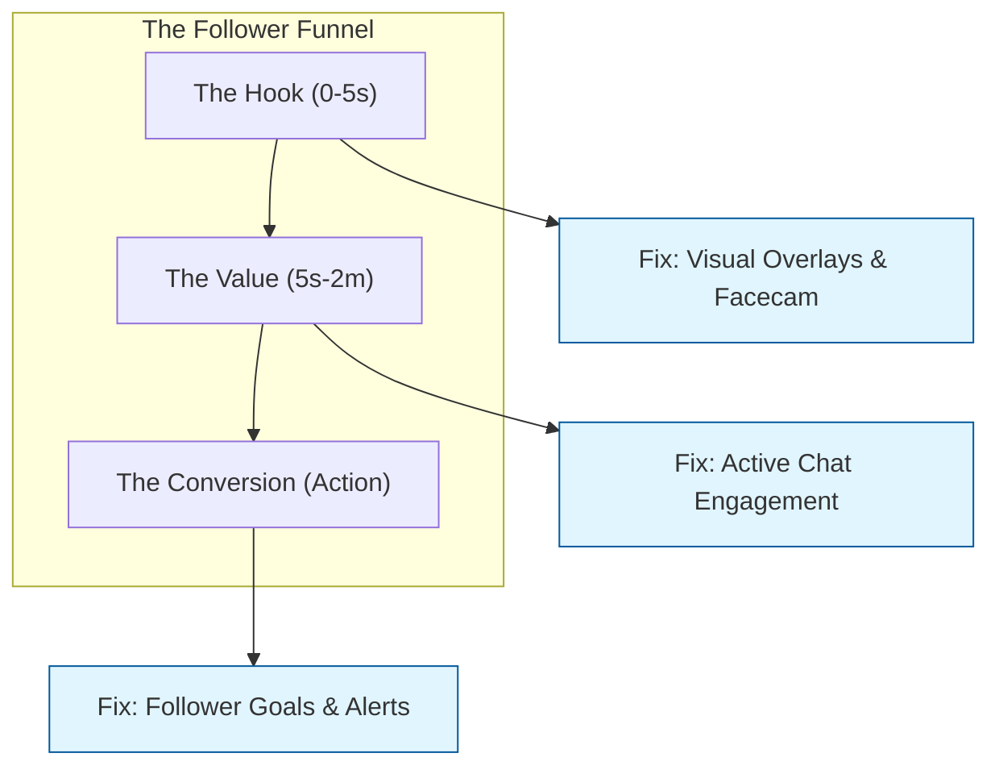

## From Passive Scroller to Follower: The Funnel Fix

If you’ve already checked the [reality check benchmarks](/blog/tiktok-live-low-follower-conversion-reality-check-2026) and found your conversion rate is below 0.5%, it’s time to stop analyzing and start fixing.

Most creators think "better content" is the answer. But on TikTok Live, **conversion is a mechanical problem.** If the viewer doesn't see a reason to follow, hear a reason to follow, or feel a benefit to following, they won't.

Here is the structural breakdown of where your "Follower Funnel" is leaking:

**Diagram Explanation**: Conversion doesn't happen at the end; it's a sequence. If your visual hook is missing, they never stay for the value. If the goal is missing, they never take action.

---

## The 4-Step Optimization Checklist

### 1. Fix the Visual "Stop" (The Hook)
When someone scrolls onto your Live, you have 3 seconds to prove you aren't an NPC or a bot.
*   **The Facecam Rule**: If you are gaming, your facecam should be bright and visible. People follow *people*, not pixels.
*   **The Interactive Overlay**: Use a "Current Goal" bar. It shouldn't just say "Followers." It should say "Help us hit 500!" Humans are hardwired to help complete unfinished tasks.

### 2. The "Bridge" Statement (The Verbal Hook)
Most viewers don't even realize they aren't following you. You need to remind them without being annoying.
*   **The Tactical Script**: *"Hey, if you're enjoying the [Game/Vibe], we're pushing for [Goal] tonight. Drop a follow to stay in the loop for the next one!"*
*   **Frequency**: Repeat this every time you see a "Viewers" spike in your analytics (usually every 5-8 minutes).

### 3. Reward the Action (The Social Credit)
On TikTok, a follow is a micro-transaction. The viewer gives you a follow; you give them **recognition**.
*   **Verbal Shoutouts**: Never miss a follow notification. Say the name: *"Yo, [Username], thanks for the follow! Welcome to the crew."*
*   **Follower-Only Perks**: Use the "Follower Only Chat" setting sparingly (only if you are being raided or spammed), but mention that followers get to pick the next game or character.

### 4. Optimize the "Landing Page" (The Profile)
When a viewer is on the fence, they often click your profile icon *while the Live is still playing* in a small window.
*   **The Bio Fix**: Does your bio say when you go live? Does it have a clear niche? 
*   **Pinned Videos**: Ensure your top 3 pinned videos represent your best Live highlights. If they see a boring profile, they won't click follow on the Live.

## Practical Conclusion

Conversion is about **reducing friction**. By adding a visual goal, giving verbal reminders, and acknowledging every new member, you turn a passive viewing experience into an active community event.

**Next Action**: For your next stream, set a "Follower Goal" of just +10. Every time someone follows, stop what you are doing for 2 seconds and thank them by name. Watch your conversion rate double.
