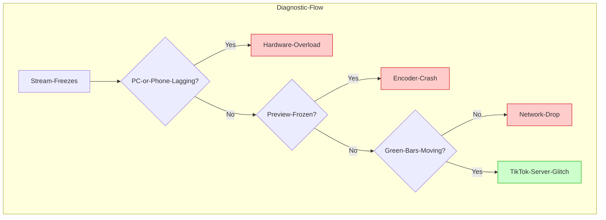

## The Nightmare: The "Infinite Spinner"

You’re in the middle of a high-kill game or a deep conversation with chat, and suddenly the comments stop moving. You look at your phone—the video is frozen. You check your PC—everything looks fine. Is it TikTok’s servers? Your internet? Or is the TikTok Live Studio app itself giving up?

On r/TikTokLive, "freezing" is the #1 complaint, but the fix depends entirely on *where* the freeze is happening.

## The Diagnostic: App Crash vs. Stream Lag

To fix this, we need to trace the "Freeze Point." If your PC is still running but the stream is stuck, you have a bottleneck.

**Figure 1**: Use this flowchart to identify the exact point of failure during a mid-stream freeze.

---

## Scenario 1: The App is Freezing (Software Issue)
If your game is smooth but **TikTok Live Studio** or the **TikTok App** becomes unresponsive:
- **Root Cause**: Memory Leak or Hardware Acceleration conflict.
- **The Fix**: 
    1. **Disable Compatibility Mode**: Ensure TikTok Live Studio is NOT running in Windows 7 compatibility mode.
    2. **Clear Cache**: Go to **Settings > General > Clear Cache** inside the Studio app.
    3. **GPU Driver Update**: TikTok Live Studio relies heavily on Chromium. Stale GPU drivers can cause the "Browser Source" layer to freeze the entire app.

## Scenario 2: The Stream is Freezing (Network/Encoder)
If the app looks fine to you, but your *viewers* say it’s frozen:
- **Root Cause**: "Dropped Frames" due to network congestion or encoder overload.
- **The Fix**:
    1. **Check the Bitrate**: If you are pushing 8000kbps on a 10mbps upload connection, any minor "jitter" will freeze the stream. Drop to **6000kbps** for stability.
    2. **Switch Encoders**: If you're using **NVIDIA NVENC** and your game is hitting 100% GPU usage, the encoder won't have enough "room" to breathe. Cap your game's FPS to free up GPU resources.
    3. **Use a Wired Connection**: WiFi "micro-drops" are the leading cause of the "Infinite Spinner" for viewers.

---

## Decision Guide: Quick Fixes for Mid-Stream Freezes

| Symptom | Probable Cause | Immediate Action |
| :--- | :--- | :--- |
| **Comments still work, video is frozen** | Encoder Error | Toggle Virtual Camera Off/On (if using OBS). |
| **Entire App is 'Not Responding'** | RAM/CPU Spike | Task Manager > End Task > Restart as Administrator. |
| **Stream freezes every 10-15 minutes** | DHCP Lease/WiFi Jitter | Use a Static IP or Ethernet Cable. |

## FAQ: "Is it normal for TikTok Live Studio to use 40% of my CPU?"
Actually, no. If TikTok Live Studio is using more than 15-20% of a modern CPU while idle, you likely have a **Browser Source** (like an overlay) that is poorly optimized. Try removing your overlays one by one to see which one is "leaking" memory.

## TL;DR (Actionable Summary)
1. **Watch the Status Bar**: If the kbps drops to 0, it's your internet.
2. **Cap Your FPS**: Leave 10% GPU overhead for the TikTok encoder.
3. **Admin Mode**: Always run your streaming software as an Administrator to give it priority over other apps.

**Next Action**: Next time you freeze, don't just restart. Check the **"Log Files"** in TikTok Live Studio or OBS. If you see "Number of dropped frames due to rendering lag," you need to lower your in-game graphics settings.
