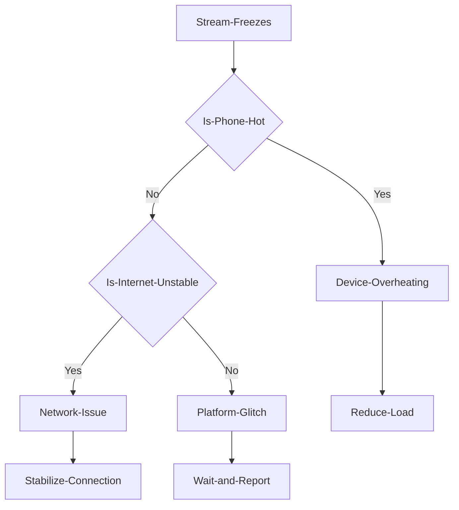

## TL;DR
If your TikTok Live freezes mid-stream, it's likely one of three culprits: **Device Overheating**, **Network Instability**, or a **Platform Glitch**. 
*   **To check for overheating:** Feel your phone. Is it hot? 
*   **To check your network:** Run a speed test. Is your upload speed fluctuating? 
*   **To check for a platform glitch:** Search Twitter or Downdetector for "TikTok Live down."

## The Silent Stream Killer
You're an hour into a great stream. The chat is buzzing, the vibes are right, and then... silence. Your viewer count is stuck, the chat isn't updating, and your phone feels like it could fry an egg. You've just been hit by the silent stream killer: the mid-stream freeze.

As one creator on Reddit put it, "I can usually get about 10 minutes into watching a Live and it freezes constantly, but everything else loads fine after the fact." This uncertainty is the most frustrating part. Is it your gear? Your Wi-Fi? Or is TikTok just having a bad day?

This guide will walk you through a diagnostic checklist to pinpoint the cause of the freeze and get you back to stable streaming.

*This diagram shows the diagnostic flow to determine the root cause of a stream freeze. Most creators blame the platform first, but overheating and network issues are far more common.*

## Step 1: The Device Health Check (Is Your Phone the Problem?)
Before you blame TikTok, let's check your streaming device. The TikTok app is resource-intensive, and older phones or phones with packed storage often struggle.

*   **The Heat Test:** Is your phone physically hot to the touch? If so, it's likely overheating. The processor is throttling itself to prevent damage, which causes the stream to freeze.
    *   **The Fix:**
        *   Remove your phone case.
        *   Lower your screen brightness.
        *   Close all other apps before going live.
        *   If you're charging while streaming, use a slower charger. Fast charging generates more heat.

*   **The Storage Test:** How much free storage do you have? If your device is nearly full, it doesn't have enough space for the app to cache data, leading to freezes.
    *   **The Fix:** Aim for at least **5-10 GB of free space**. Delete old videos, clear your cache, and offload photos to the cloud.

## Step 2: The Network Stability Check (Is Your Internet the Problem?)
A high-speed connection isn't enough; you need a *stable* one. TikTok Live requires a consistent upload stream.

*   **The Wi-Fi vs. Data Test:** Does the freezing happen on both Wi-Fi and mobile data? If it only happens on one, you've found your culprit.
    *   **The Fix (Wi-Fi):**
        *   Move closer to your router.
        *   Switch to the 5GHz band if available. It's faster and less congested than the 2.4GHz band.
        *   Restart your router before you go live.
    *   **The Fix (Mobile Data):**
        *   Find a spot with a stronger signal.
        *   Be aware of your data cap. Some carriers throttle speeds after a certain usage limit.

*   **The Speed Test:** Use a speed test app (like Ookla) to check your **upload speed**. Is it fluctuating wildly? Anything less than 3-5 Mbps of *stable* upload speed will struggle.

## Step 3: The Platform Health Check (Is TikTok the Problem?)
If your device is cool, your storage is clear, and your internet is stable, the problem might be on TikTok's end.

*   **The Downdetector Test:** Check sites like Downdetector or search Twitter for "TikTok down" or "TikTok Live issues." If there's a spike in reports, it's a platform-wide problem.
    *   **The Fix:** Unfortunately, the only fix here is to wait. Follow the official @TikTokSupport Twitter account for updates.

*   **The App Cache Test:** Sometimes, the app's cache can become corrupted.
    *   **The Fix:**
        1.  Go to your TikTok **Profile** > **Settings and privacy**.
        2.  Scroll down to **Clear cache**.
        3.  Restart the app.

## FAQ
**Q: Could it be a "shadowban"?**
A: It's highly unlikely. A shadowban would affect your video's reach on the For You Page, not the technical stability of your stream. Freezing is a technical issue, not a content moderation one.

**Q: Does this happen more on iPhone or Android?**
A: Both platforms are affected, but the causes can differ. iPhones are more prone to thermal throttling (overheating), while Android devices can have issues with background apps and aggressive battery-saving modes.

**Q: I'm using TikTok Live Studio on a PC and it's freezing. What should I do?**
A: PC freezing is often due to different reasons, like encoder overload or software conflicts. Check our guide on [fixing TikTok Live Studio freezes](/blog/tiktok-live-studio-freezes-mid-stream-fix-2025) for PC-specific solutions.

## The Verdict
The next time your stream freezes, don't just end the live in frustration. Work through this checklist. Start with your device, then your network, then the platform. By diagnosing the problem systematically, you can find a real solution and get back to creating content without interruptions.
