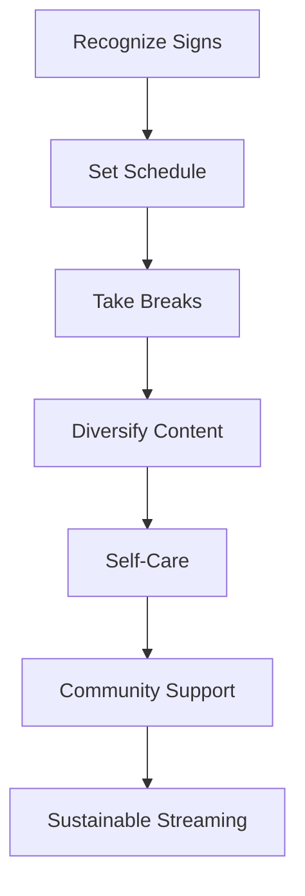

## TL;DR

Burnout hits hard in TikTok Live gaming – that constant grind can drain you fast. But with smart scheduling, intentional breaks, and content variety, you can stream longer without crashing.

## Introduction

Picture this: You're deep into a TikTok Live gaming marathon, but instead of excitement, it's all exhaustion. It's a common story among small streamers, where the push for views leads to mental fatigue. Pulling from typical talks in communities like r/smallstreamers, I'll share real ways to spot burnout and fight back.

## Actionable Steps

Here's a simple flowchart for preventing burnout:

Under this diagram: Follow this flow to build habits that prevent burnout – start with awareness and end with balanced streaming.

1. Lock in a Realistic Schedule: Limit yourself to short bursts – think 2-3 hours, a few days a week. It leaves room for life.

2. Schedule Those Breaks: Use an app or alarm to step away briefly. A quick walk or snack can reset your energy.

3. Mix It Up: Gaming all the time? Add interactive segments like polls or casual chats to keep things fun and less repetitive.

4. Focus on You: Don't skip workouts, good sleep, or non-streaming fun. These recharge your batteries.

5. Build Your Support Squad: Chat with other streamers online; sharing experiences can lighten the load.

## FAQ / Notes

Q: What if breaks mean fewer viewers? A: True fans value your vibe over endless hours. It often leads to better engagement long-term.

Note: Pay attention to red flags like loss of joy in gaming or physical tiredness.

## Conclusion

Applying these steps? You'll transform your TikTok Live experience from draining to energizing. Prioritize yourself – sustainable streaming is the key to lasting success.