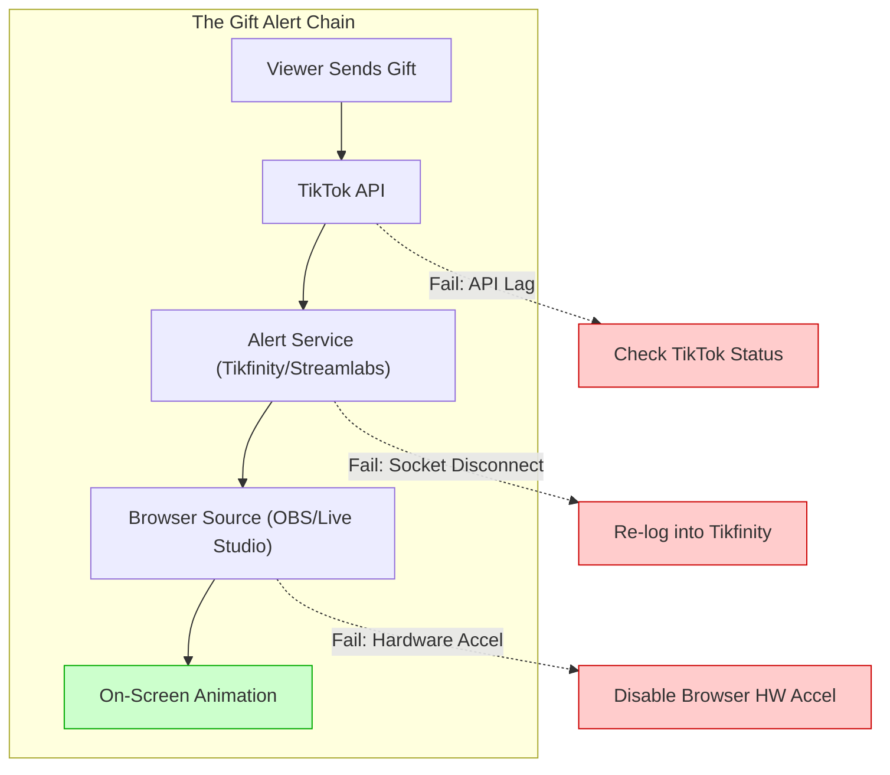

## The Panic: "Thanks for the... invisible gift?"

It’s every streamer’s nightmare. You see "Sent a Rose" in the chat, but your screen stays empty. No animation, no sound, no hype. You look at your stream health—it’s green. Your internet is fine. So why are your gifts invisible?

On r/TikTokLive, this is often misdiagnosed as "TikTok being broken." While server lag happens, 90% of the time the issue lies in your **Alert Path Bottleneck**.

## The Diagnostic: Where is the Gift Getting Stuck?

A TikTok gift doesn't just "appear." it travels through a specific chain. If one link breaks, the alert dies.

**Figure 1**: The alert path. Most "invisible gift" issues occur between the Alert Service and the Browser Source.

---

## The Fix-Oriented Checklist

### 1. The "Socket" Refresh (Most Common Fix)
If you use **Tikfinity** or **Streamlabs**, your "Socket Token" might have expired.
- **Action**: Log out of your alert dashboard and log back in. 
- **Why**: TikTok's API frequently refreshes session tokens. If your alert service isn't "listening" to the right token, it ignores the gift events.

### 2. The Browser Source Hardware Bottleneck
If your stream seems fine but alerts are laggy or missing, your OBS/Live Studio might be struggling to render the animation.
- **Action**: In OBS, go to **Settings > Advanced** and check **"Enable Browser Source Hardware Acceleration"**. 
- **The Twist**: If it's already ON, try turning it OFF. Some GPU drivers (especially NVIDIA) conflict with TikTok's heavy alert animations.

### 3. Clear the Browser Cache
Browser sources in streaming software are just hidden Chrome tabs. They get "clogged" just like your regular browser.
- **Action**: In your Browser Source properties, click **"Refresh cache of current page"**.
- **Pro Tip**: If using Tikfinity, ensure your "Setup" tab shows "Connected" with a green dot while you are live.

---

## Decision Guide: Is it You or TikTok?

| Symptom | Probable Cause | Fix |
| :--- | :--- | :--- |
| **Gifts show in chat but not screen** | Alert Service Disconnect | Re-link TikTok account in Tikfinity/Streamlabs. |
| **Alerts are delayed by 30s+** | Internet Upload Jitter | Lower your bitrate or use a wired Ethernet connection. |
| **No gifts in chat OR screen** | Region/Account Shadowban | Verify your "Gift Revenue" is enabled in Creator Tools. |

## FAQ: "Why do some gifts show and others don't?"
This usually happens with **Combo Gifts** (like 100x Roses). Some alert services have a "Minimum Gift Value" setting. Check your Alert Box settings to ensure "Rose" isn't filtered out to prevent spam.

## TL;DR (Actionable Summary)
1. **Refresh your Socket**: Log out and back into Tikfinity.
2. **Clear Cache**: Hit the refresh cache button in your OBS Browser Source.
3. **Check Connection**: Ensure your alert service dashboard shows "LIVE" status.

**Next Action**: Run a "Test Alert" from your dashboard. If the test shows up but real gifts don't, your API connection is stale. Re-link your account immediately.
