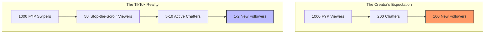

## The Silent Failure: "I'm Getting Views, But No One Stays"

You finish a stream with 10,000 total viewers. You’re exhausted, you’ve been engaging for three hours, and you check the summary: **+14 Followers**.

The immediate reaction is a mix of confusion and self-blame. *Is my content boring? Did I forget to ask for follows? Is the algorithm just teasing me with empty numbers?* On subreddits like r/TikTokCreators, this is the #1 source of burnout. Creators see the high view count as a "promise" of growth that never actually arrives.

But here is the truth: **You aren't failing. You are just measuring the wrong thing.**

## The Expectation vs. Reality Gap

Most creators enter TikTok Live with "Twitch Brain." On Twitch, if someone finds your stream, they likely searched for your game or clicked a specific thumbnail. They are already high-intent. On TikTok, the "For You" feed is a passive firehose.

Here is how the conversion funnel actually looks compared to how we *think* it looks:

**What this diagram shows:**
The "drop-off" between a view and a follow is not a leak in your bucket—it is the nature of the platform. TikTok is a high-volume, low-friction discovery engine. The "Reality" side shows that 95% of people swiping past you are in a "passive trance." They aren't rejecting you; they just haven't been given a reason to wake up yet.

## What is a "Normal" Conversion Rate in 2026?

Based on data from mid-sized creators and community discussions, here are the benchmarks you should actually be looking at:

| Metric | "Healthy" Range | The "Burnout" Trap |
| :--- | :--- | :--- |
| **Follower Conversion** | 0.1% - 0.5% of total viewers | Expecting 5% - 10% |
| **Viewer Retention** | 1 - 2 minutes average | Expecting everyone to stay for 20 mins |
| **Like-to-View Ratio** | 5% - 10% | Thinking likes = follows |

**Diagnostic Rule:** If you are gaining **1 follower for every 200–500 total viewers**, you are doing perfectly fine. If you are below 1 per 1,000, we need to look at your "Hook" and "Context."

## 3 Reasons Your Conversion Feels "Broken"

If your numbers are significantly below the benchmarks above, it's usually one of these three structural issues:

### 1. The "Mid-Sentence" Joiner Problem
Because of the FYP, people join your stream at random seconds. If you are 5 minutes into a complex story without a "pinned comment" or visual text explaining what's happening, the new viewer feels like they walked into a movie halfway through. They swipe up in 3 seconds.
*   **The Fix:** Use a "Goal Bar" or a text overlay that explains the current activity (e.g., "Level 50 Hardcore Run").

### 2. Low "Profile-Click" Synergy
Most follows happen *after* a viewer clicks your profile picture. If your profile bio is empty or your pinned videos don't match the "vibe" of your Live, they won't commit.
*   **The Fix:** Ensure your top 3 pinned videos represent your best Live moments.

### 3. The Lack of a "Reason to Return"
Entertainment is a commodity on TikTok. Why should they follow you instead of just waiting for the algorithm to show them someone else equally funny?
*   **The Fix:** Give them a schedule or a "Series" hook. "We do this every night at 9 PM" is a much stronger follow-trigger than "Follow for more."

## FAQ: Questions Creators Search Verbatim

**Q: Is it normal to get 5k views and only 5 followers?**
A: Yes. In the 2026 algorithm, a 0.1% conversion rate is standard for FYP-heavy streams. You are competing with a billion other distractions.

**Q: Why do some people get thousands of followers in one Live?**
A: Usually, they are running a "High-Stakes" hook (like a controversial debate or a massive giveaway) or they are already a massive short-form creator whose followers are finally seeing them Live.

**Q: Should I ask for follows every 5 minutes?**
A: No. Instead of "asking," try "integrating." Tie the follow to a milestone. "At 50 follows, we’re switching to the viewer-requested map."

## Conclusion: Calibration is the Key to Consistency

Stop looking at the total view count as a measure of your worth. TikTok Live is a **Top-of-Funnel** discovery tool. Its job is to cast a wide net; your job is to keep the few people who actually resonate with your personality.

If you got 10 followers today, that’s 10 real humans who want to see you again. In a month, that’s 300. In a year, that’s a community. Focus on the humans, ignore the "ghost" views, and keep the scroll-breakers coming.
