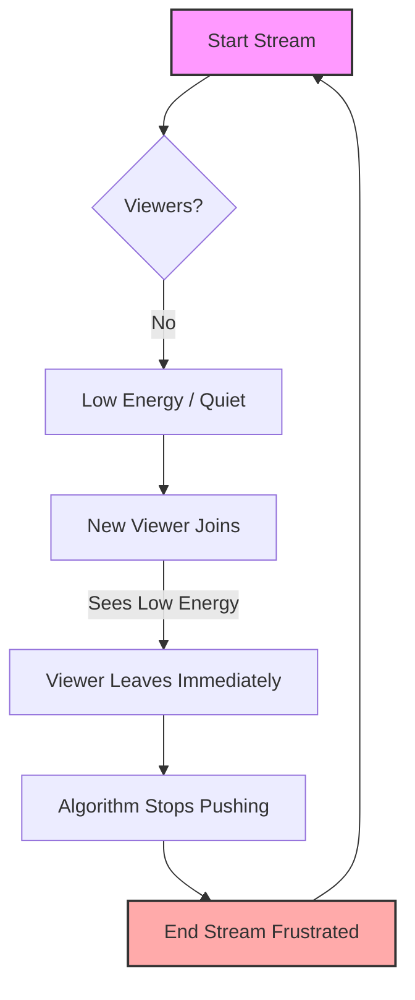

## The "Grind" is a Trap

You hit "Go Live." You play your game or talk to the camera. You wait.
Four hours later, you end the stream.
Stats: **Max Viewers: 1. Unique Viewers: 3.**

You do it again the next day because everyone says, "Consistency is key."
Two weeks later, you're burnt out, angry, and convinced the algorithm hates you.

This is the most common cause of **TikTok Live motivation loss** on r/smallstreamers.
The pain isn't just the low numbers; it's the feeling of *effort without reward*.

Here is the hard truth: **On TikTok Live, consistency without a hook is just consistently being ignored.**
You cannot "grind" your way out of zero viewers. You have to "eventize" your way out.

## Mistake: "I Just Need to Stream More Hours"

Many streamers treat TikTok Live like Twitch in 2015. They think if they are online long enough, someone will stumble in.
But TikTok's For You Page (FYP) doesn't reward *duration*; it rewards *retention*.

If you stream for 4 hours to 0 people, you are telling the algorithm 4,000 times a second that your stream is not worth watching.

### The Correction: The "Event" Mindset

Stop streaming "whenever." Start streaming "for a reason."

| The "Grind" Mindset (Wrong) | The "Event" Mindset (Right) |
| :--- | :--- |
| "I'll go live at 7 PM and play Valorant." | "At 7 PM, I'm ranking up to Diamond or deleting the game." |
| "Come hang out!" | "Watch me attempt this specific challenge." |
| Streaming 6 hours/day, 7 days/week. | Streaming 2 hours/day, 3 days/week (high energy). |
| Hope the algorithm finds you. | Feed the algorithm a clear hook. |

## The "Motivation Loss" Feedback Loop

You need to visualize why you are losing motivation so you can break the cycle.
It’s not because you are lazy. It’s because your feedback loop is broken.

**The Zero-Viewer Death Spiral:** Low viewers cause low energy, which causes lower viewers.

**Why this matters:** You cannot fix step `E` (Viewer Leaves) by just doing step `A` (Start Stream) more often. You have to break the link between `B` and `C`.

## How to Break the Cycle (Step-by-Step)

If you are stuck at 0-3 viewers and want to quit, stop streaming for 3 days. Reset. Then do this:

### 1. The "Empty Room" Performance Rule
Never look at your viewer count. Turn it off. Hide it.
Assume there are 100 people watching.
- **Narrate everything:** "Okay, I'm checking this corner because..."
- **Greet the lurkers:** "If you're just joining, we are currently trying to..."
- **Fake the energy until it's real.**
If you wait for a chatter to speak before you speak, you have already lost them.

### 2. Shorten Your Streams
Cut your stream time in half.
- **Old:** 4 hours of low-energy gameplay.
- **New:** 90 minutes of high-focus, high-energy content.
It is easier to be entertaining for 90 minutes than for 4 hours.

### 3. Change Your Title Every 30 Minutes
If no one is coming in, your "packaging" is wrong.
- **Bad Title:** "Chilling / Vibes / Road to Affiliate"
- **Good Title:** "Losing = Gift Sub" or "Chat Picks My Loadout"
If the bait isn't working, change the bait. Don't just sit there fishing in an empty bucket.

## FAQ: Real Questions from r/smallstreamers

**Q: Should I delete my account and start over?**
A: **No.** Unless you bought fake followers, your account is fine. You just need to train the algorithm with better retention data. Starting over just resets your progress to true zero.

**Q: Is it better to stream on a schedule or when I have energy?**
A: **Energy > Schedule.** A boring stream on schedule hurts you more than an exciting stream off-schedule. TikTok notifies followers, but the FYP brings new people. The FYP cares about energy (retention).

**Q: Why do I get 500 views on videos but 0 on Live?**
A: Videos and Live are different skills. Videos are edited and perfect. Live is raw. You need to bring your video personality into your live stream. Try posting a video *1 hour before* you go live to drive traffic.

## Conclusion

Motivation returns when results return.
But results don't come from suffering through 4-hour streams to an empty room.
They come from treating your stream like a show, not a surveillance camera.

Stop grinding. Start performing.
The viewers will follow the energy.
