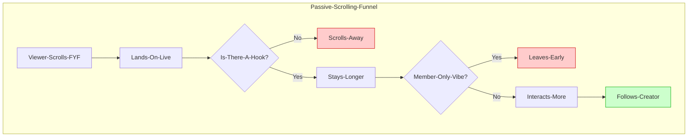

If you’ve been lurking in r/TikTokCreators, you’ve seen the post: *"I had 500 viewers in my live, but only gained 2 followers. Is my content bad?"*

There is a massive expectation gap between how we think TikTok Live works and how the algorithm actually treats viewers. Most creators expect their Live stream to act like a YouTube video (high intent, high follow rate), but on TikTok, Live is often just "background noise" in a vertical scroll.

## TL;DR
A "normal" follow-to-viewer conversion rate on TikTok Live is significantly lower than on short-form videos. If you are gaining **1 follow per 100-200 unique viewers**, you are actually doing fine. The problem isn't usually your content—it's the **Passive Scrolling Meta**.

---

## The Expectation vs. Reality Gap

The biggest reason creators feel like they are failing is that they compare their Live stats to their Video stats. But the psychology of a viewer entering your stream from the For You Feed (FYF) is completely different from someone searching for your name.

**What this diagram shows:**
The journey from "Scroll" to "Follow" is a gauntlet. The bottleneck isn't just "content quality"—it's **Inclusivity**. If a viewer feels like they walked into a private conversation they don't understand, they won't follow, no matter how many viewers you have.

---

## 3 Reasons Your Conversion Feels 'Low'

### 1. The 'Background Noise' Factor
Many TikTok users use Live as background noise while doing homework or chores. They might watch you for 20 minutes without ever looking at their screen.
*   **The Reality:** They are "watching," but they aren't "engaged." You can't convert someone who isn't holding their phone.

### 2. The Internal vs. External Audience
If the algorithm pushes you to a broad audience (FYF) rather than a niche audience, your conversion will drop.
*   **The Reality:** High viewer counts from the FYF often lead to *lower* conversion rates because those viewers weren't looking for you—they just happened to land on you.

### 3. The 'Inside Joke' Wall
Small streamers often focus too much on their 3-4 "regulars." When a new viewer joins and sees the streamer only talking to "Steve" about something that happened yesterday, they feel like an outsider.
*   **The Reality:** People follow when they feel like they can join the community, not just watch one.

---

## Decision Guide: Is it My Content or the Platform?

| Symptom | Probable Cause | Strategy |
| :--- | :--- | :--- |
| **High Views, 0s Watch Time** | Bad Hook / Low Energy | Change your visual layout or start talking more. |
| **High Watch Time, 0 Follows** | Lack of Call to Action (CTA) | Give them a *reason* to follow (e.g. "Follow to vote"). |
| **Low Views, High Follows** | High Quality, Low Reach | Your content is great; you just need more "Algorithm Signals." |

---

## Checklist: How to Increase Conversion Today

- [ ] **The 60-Second Reset:** Every 60 seconds, re-introduce what you are doing. New viewers have no context.
- [ ] **Interactive Goals:** Use a "Follower Goal" overlay. It gives viewers a "job" to do.
- [ ] **Name Recognition:** When someone likes the stream, say their name. Name-dropping is the fastest way to turn a "scroller" into a "follower."
- [ ] **The Value Prop:** Explicitly state what they get by following (e.g., "I go live every night at 8 PM to help you rank up in Apex").

---

## FAQ: What is 'Normal' Anyway?

**"What is a good conversion rate for TikTok Live?"**
There is no official number, but experienced creators generally see a 0.5% to 1% conversion rate (1 follow per 100-200 viewers) as a healthy baseline for a growing channel.

**"Why do I lose followers right after my Live ends?"**
This is normal. Some people follow in the heat of the moment and then realize your content isn't for them. Don't take it personally—it's just "audience pruning."

**"Does 'Promote' help with follower conversion?"**
Rarely. Paid views are often even *more* passive than organic views. It's better to focus on organic hooks.

---

## Conclusion

Stop comparing your Live follow count to your viral video stats. TikTok Live is a long-game platform. If you have viewers staying for more than a few minutes, you are winning. Focus on **Community Inclusivity** and **Clear Value**, and the followers will come—slowly, but surely.
