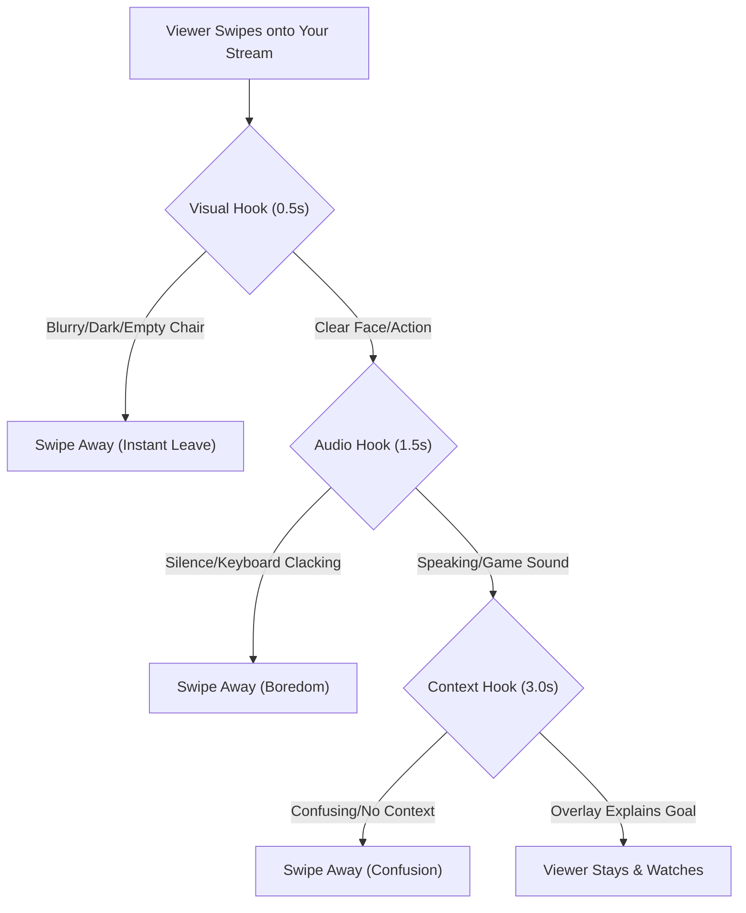

<TOCInline toc={props.toc} exclude="Introduction" />

## TL;DR
If viewers join and leave in less than 3 seconds, you are likely failing the **"Scroll Test"**. They didn't "click" your stream; they swiped into it. If you are silent, looking down, or the gameplay is blurry, they swipe away.
**The Fix:** Treat every second like a new intro, use a "Sticky Headline" overlay, and verbally acknowledge joins *before* the delay catches up.

## Introduction

It is the most demoralizing notification sequence in streaming:

> *User123 joined.*
> *(Silence)*
> *User123 left.*

You see the number go up to 1, then back to 0. Over and over again.

On r/gamestreaming, this is a constant source of paranoia. *“Are these bots?”* *“Is my stream lagging?”* *“Do I just suck?”*

The hard truth? **They probably aren't bots.** They are real people who judged your stream in 1.5 seconds and decided "Next."

TikTok Live is not Twitch. On Twitch, a viewer clicks a thumbnail with intent. On TikTok, they are **force-fed** your content while scrolling. You don't have a "viewer" yet; you have a "scroller" who is looking for a reason to stop.

Here is why they are leaving instantly and how to stop the bleed.

## Diagnosis: The "Scroll Trap" Decision Tree

Use this diagram to understand *why* the viewer left. It usually happens before they even hear your voice.

### Understanding the Diagram
*   **The Visual Gate (0.5s):** If your bitrate is pixelated or you are just a "top of head" gamer looking at a monitor, you lose 50% of traffic here.
*   **The Audio Gate (1.5s):** If they pause to look, they listen. Silence = Death.
*   **The Context Gate (3s):** "What is happening?" If they can't answer that in 3 seconds, they leave.

## Reason 1: The "Silent Gamer" Syndrome

This is the #1 killer for gaming streamers.

You are focused on a clutch moment in *Valorant*. You are silent. A viewer swipes in. They see a guy staring at a screen, not talking. They leave.

**The Reality:** You think you are "focused." The viewer thinks you are "AFK" or "boring."

### The Fix: "Always Be Narrating" (ABN)
You cannot wait for a viewer to join to start talking. The stream delay (3–5 seconds) means by the time you see "User joined" and say "Hello," they are already gone.

*   **Narrate your thoughts:** "Okay, hearing footsteps left, gonna hold this angle..."
*   **Narrate your mistakes:** "Wow, I totally whiffed that spray."
*   **Narrate your plan:** "After this match, we're switching to Ranked."

If you are talking *before* they join, they walk into a conversation, not a library.

## Reason 2: You Failed the "Visual Vibe Check"

TikTok is a visual platform. If your stream looks like a murky 720p dungeon, users assume low quality.

### Common Visual Turn-Offs:
*   **The "Forehead Cam":** Your camera is angled too high, showing your ceiling fan and forehead.
*   **The "Dark Room":** You have RGB lights behind you, but your face is in total shadow.
*   **The "UI Clutter":** Your overlay covers 40% of the screen with "Recent Follower" text that no one cares about.

### The Fix: Lighting & Framing
*   **Light your face:** A $20 ring light in front of you is worth more than a $500 GPU for retention.
*   **Eye Level:** Put the camera at eye level. Eye contact (even with the lens) creates psychological connection.

## Reason 3: No "Sticky" Context

A viewer joins mid-game. You are fighting a boss. They don't know who you are, what game this is, or why it matters.

**Why they leave:** Confusion. "Just another guy playing generic shooter."

### The Fix: The "Context Overlay"
Put a simple text line on screen that explains the *current* stakes.
*   *Bad:* "Follow for more!" (Desperate)
*   *Good:* "Trying to hit Diamond Rank today (2 wins away)"
*   *Good:* "Hardcore Run: If I die, I restart"

This gives the "Scroller" a reason to wait and see the outcome.

## Actionable Checklist: The "Retention Audit"

Watch your own VOD (Video on Demand) from yesterday. Pick 3 random timestamps.

1.  **Visual:** Is my face clearly visible and lit?
2.  **Audio:** Was I speaking within the first 5 seconds of that timestamp?
3.  **Context:** Would a stranger know *exactly* what I was doing?

If you answered "No" to any of these, that is why they are leaving. It’s not the algorithm. It’s the show.
