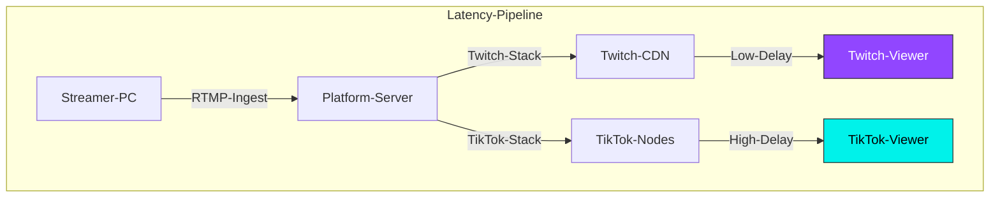

If you’ve ever tried to run a "Reaction" stream or a high-intensity Q&A, you know that **latency is the silent killer of engagement.**

You ask a question. You wait. 5 seconds. 10 seconds. Finally, a response pops up. By then, you’ve already moved on to the next topic.

On Reddit's r/streaming, creators often ask: *"Why is my Twitch delay only 2 seconds, but TikTok feels like it's 8 seconds behind?"* Or conversely, *"Why does TikTok feel instant while Twitch buffers?"*

The answer isn't just "bad internet." It’s a fundamental difference in how these two giants handle video data.

## The Latency Architecture: Twitch vs. TikTok

Twitch was built for the desktop web. TikTok was built for the mobile feed. This distinction dictates their entire technical stack.

### What this diagram shows:
Twitch uses a highly optimized version of **HLS (HTTP Live Streaming)** designed to keep the "Glass-to-Glass" latency as low as possible for chat interaction. TikTok, however, prioritizes **stability and compatibility** for billions of mobile devices on varying 4G/5G connections, which often results in a slightly longer buffer (transcoding) stage at the edge nodes.

---

## 3 Key Differences You Actually Feel

### 1. The "Ingest" Protocol Battle
Twitch allows for "Low Latency" mode, which reduces the segment size of the video data. TikTok’s ingest is often more restrictive, especially if you are using **TikTok Live Studio** versus a direct **Stream Key via OBS**. 
*   **The Reality:** TikTok Live Studio adds an extra layer of processing that can introduce 2–3 seconds of local latency before the stream even hits the server.

### 2. CDN Distribution (The Global Factor)
Twitch has spent a decade building its own video-specific CDN. TikTok uses ByteDance’s massive global infrastructure, which is optimized for **throughput** (making sure the video doesn't stop) rather than **latency** (making sure it’s fast).
*   **The Result:** You might get 200 viewers from 5 different continents on TikTok. To keep that stream smooth for someone in London AND someone in Tokyo, TikTok adds a larger "jitter buffer."

### 3. Interaction Design
Twitch chat is "Real-Time First." TikTok Live is "Algorithm First." On TikTok, the app is constantly trying to determine if your stream should be shown to the next person scrolling. This "Background Evaluation" can sometimes cause the stream to feel desynced from the chat notifications.

---

## Which One is Better for You?

| Feature | Twitch (Low Latency) | TikTok Live |
| :--- | :--- | :--- |
| **Average Delay** | 1.5s - 4s | 5s - 10s |
| **Chat Interaction** | Near Instant | Slight "Talk-to-Text" Gap |
| **Stability** | Variable (Buffers more) | High (Rarely buffers) |
| **Best For** | Competitive Gaming / Q&A | Discovery / Viral Reach |

---

## How to Minimize Latency on TikTok Live

If the delay is ruining your gaming interaction, try these three technical fixes:

- [ ] **Switch to OBS (If possible):** If you have access to a Stream Key, use OBS with the **Aitum Vertical Plugin**. OBS's encoder is generally more efficient than TikTok Live Studio.
- [ ] **Force "Performance Mode":** In TikTok Live Studio settings, disable "Compatibility Mode" and set your bitrate to a stable **6000kbps**. Over-pushing your bitrate (e.g., 9000+) forces TikTok to transcode more aggressively, adding delay.
- [ ] **The "Hardwire" Rule:** Never stream on TikTok via Wi-Fi if you care about latency. The "jitter" on Wi-Fi forces the platform to increase your buffer size to prevent freezes.

## FAQ

**Q: Can I get "Zero Latency" on TikTok?**  
A: No. Unlike WebRTC-based platforms (like Discord calls), both Twitch and TikTok use segment-based delivery. A 3–5 second delay is the "Gold Standard" for broadcast-scale streaming.

**Q: Why does my delay get worse over time?**  
A: This is called "Latency Drift." If your upload speed dips for even a second, the player adds a buffer to stay smooth. It rarely "catches up" automatically. 
*   **Fix:** Occasionally refresh your stream dashboard or have your mods tell you if the delay exceeds 15 seconds.

## Conclusion

Twitch wins the **Speed** race, but TikTok wins the **Stability** race. For gamers, this means you need to adjust your pacing. If you are on TikTok, don't wait for a response after every sentence. Keep the momentum going and treat the chat as a "delayed reaction" feed rather than a phone call. 
