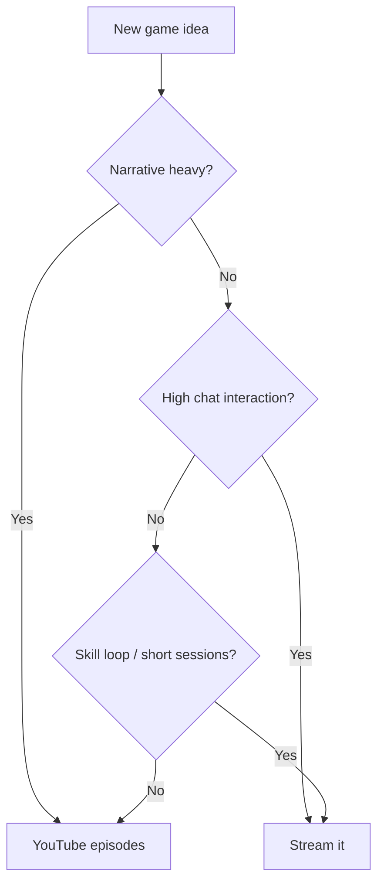

A common r/streaming question: which games work better live, and which belong on YouTube? A recent thread framed it perfectly—"Streaming is the experience; YouTube is the highlight." Here’s a practical way to decide, using Red Dead Redemption 2 as a running example.

## Quick Rules of Thumb

- **Stream it** when gameplay invites chat participation, repeatable moments, and downtime banter (roguelikes, multiplayer, challenge runs).
- **Record it for YouTube** when story pacing, clean arcs, and edits improve the viewing experience (long-form narrative campaigns).

## Audience Fit Matrix

## Mermaid: Decision Tree for New Series

## RDR2: Stream or Upload?

- **Stream**: open-world shenanigans, hunting challenges, roleplay moments, chat‑driven choices.
- **YouTube**: story missions in clean arcs, cinematic edits, collectibles guides.

## Production Tips

- For streams, prep conversation prompts for quiet segments.
- For YouTube, capture at high bitrate; record clean audio; script your intro/outro.
- Recycle: turn stream VODs into highlight reels; turn narrative playthroughs into guides.

## SEO and Titles

- Stream titles: make the experience explicit ("Permadeath run #2 | Chat picks bounties").
- YouTube titles: outcome + value ("RDR2: Chapter 3 in 20 Minutes – No Spoil Filler").

—

Inspired by a real discussion from r/streaming. If this helped, tell me which game you’re debating next—I’ll map it for you.

