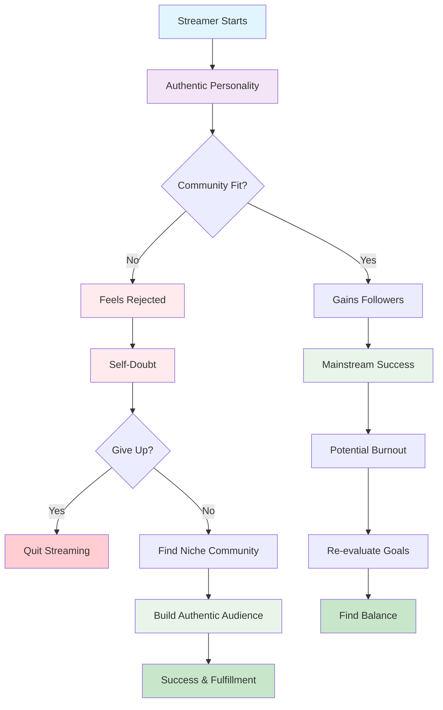

```mermaid
graph TD
    A[Streamer Starts] --> B[Authentic Personality]
    B --> C{Community Fit?}
    C -->|Yes| D[Gains Followers]
    C -->|No| E[Feels Rejected]
    E --> F[Self-Doubt]
    F --> G{Give Up?}
    G -->|Yes| H[Quit Streaming]
    G -->|No| I[Find Niche Community]
    I --> J[Build Authentic Audience]
    J --> K[Success & Fulfillment]
    D --> L[Mainstream Success]
    L --> M[Potential Burnout]
    M --> N[Re-evaluate Goals]
    N --> O[Find Balance]
    
    style A fill:#e1f5fe
    style B fill:#f3e5f5
    style E fill:#ffebee
    style F fill:#ffebee
    style H fill:#ffcdd2
    style J fill:#e8f5e8
    style K fill:#c8e6c9
    style L fill:#e8f5e8
    style O fill:#c8e6c9
```
