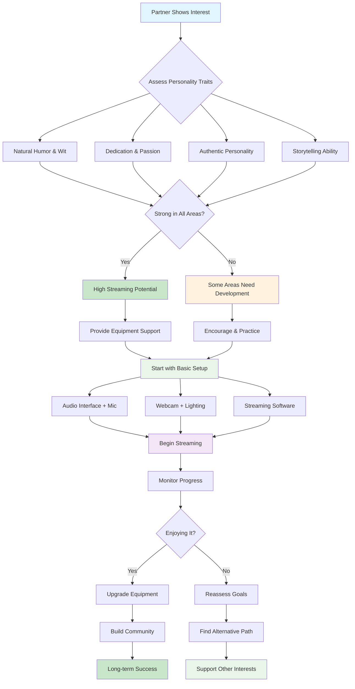

```mermaid
graph TD
    A[Partner Shows Interest] --> B{Assess Personality Traits}
    B --> C[Natural Humor & Wit]
    B --> D[Dedication & Passion]
    B --> E[Authentic Personality]
    B --> F[Storytelling Ability]
    
    C --> G{Strong in All Areas?}
    D --> G
    E --> G
    F --> G
    
    G -->|Yes| H[High Streaming Potential]
    G -->|No| I[Some Areas Need Development]
    
    H --> J[Provide Equipment Support]
    I --> K[Encourage & Practice]
    
    J --> L[Start with Basic Setup]
    K --> L
    
    L --> M[Audio Interface + Mic]
    L --> N[Webcam + Lighting]
    L --> O[Streaming Software]
    
    M --> P[Begin Streaming]
    N --> P
    O --> P
    
    P --> Q[Monitor Progress]
    Q --> R{Enjoying It?}
    R -->|Yes| S[Upgrade Equipment]
    R -->|No| T[Reassess Goals]
    
    S --> U[Build Community]
    T --> V[Find Alternative Path]
    
    U --> W[Long-term Success]
    V --> X[Support Other Interests]
    
    style A fill:#e1f5fe
    style H fill:#c8e6c9
    style I fill:#fff3e0
    style L fill:#e8f5e8
    style P fill:#f3e5f5
    style W fill:#c8e6c9
    style X fill:#e8f5e8
```
